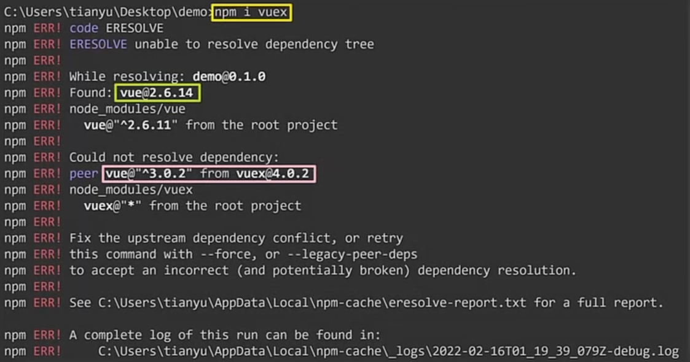

# 一、Vue全家桶

## 1、Vue的概述

### 1）Vue的特点

- 组件化模式
- 声明式编码

### 2）MVVM模型

- M	  Model，对应data中的数据
- V		View，对应模板
- VM	ViewModel，Vue的实例对象

### 3）快速编码

#### （1）用户代码片段

```javascript
// 设置-用户代码片段
	"new Vue()": {
		"prefix": "v1",
		"body": [
			"new Vue({",
			"  el:'#root',",
			"  data:{}",
			"});"
		]
	}
```

#### （2）简写

| <a v-bind : href = " url " > | <a	: href = " url " > |
| :--------------------------: | :----------------------: |
|    v-model：value = “aa”     |      v-model = “aa”      |
|           v-on:xxx           |           @xxx           |

#### （3）代码折叠

- 适用于折叠大区域的代码片段

```javascript
#region
...
...
#enregion
```

### 4）前端基础

#### （1）js-表达式

|         表达式          |                             内容                             |
| :---------------------: | :----------------------------------------------------------: |
|   name.toUpperCase()    |                           转换大写                           |
|       Data.now()        |                            时间戳                            |
|   Object.keys( obj )    |                以数组形式提取对象的所有属性名                |
| String . slice (0 , 3)  |                     字符串截取前3个字符                      |
| String . indexOf ( val) | 判断字符串中是否含有特定字符，没有则返回 -1 ，有则返回下标；若该特定字符是空字符，则默认返回 0 |
| arr = value.split ('-') |                     分割，形成 arr 数组                      |

#### （2）js-基础

- ==触发事件，先由外至内捕获，再由内到外冒泡==
- 定时器

```javascript
	methods:{
        stop(){
            clearInterval(this.timer)	// 销毁定时器
        }
    },
    mounted(){
        this.timer = setInterval( (){
                                 		//	
                                 })
    }
```

#### （3）js-e事件

|      内容      |   含义   |
| :------------: | :------: |
|     e.key      |  按键名  |
|   e.keyCode    | 按键编码 |
|    e.target    |   元素   |
| e.target.value | 元素的值 |

#### （4）css-基础

| overflow   :   auto | 溢出则使用滚动条 |
| :-----------------: | :--------------: |
|                     |                  |

## 2、基础语法

### 1）页面数据

#### （1）模板语法

- 插值语法		{{ name }}

- 指令语法		

  ```javascript
  <a v-bind : href = " url " >
  <a	: href = " url " >
  ```

#### （2）内置指令

|   语句    |                        含义                         | 说明 |
| :-------: | :-------------------------------------------------: | :--: |
|  v-bind   |          单向绑定解析表达式, 可简写为 :xxx          |      |
|  v-model  |         双向数据绑定，只能应用于表单类元素          |  1   |
|   v-for   |                遍历数组/对象/字符串                 |      |
|   v-on    |               绑定事件监听, 可简写为@               |      |
|   v-if    |                条件渲染（是否存在）                 |  2   |
|  v-else   |                条件渲染（是否存在）                 |      |
| v-else-if |                条件渲染（是否存在）                 |      |
|  v-show   |                 条件渲染 (是否展示)                 |      |
|  v-text   |  渲染文本内容，会替换掉节点中的内容，{{xx}}则不会   |  3   |
|  v-html   | ==安全性问题，容易导致 XSS 攻击，绝对不能用于表单== |      |
|  v-once   | 无值，节点在初次渲染后不再改变，优化数据驱动的性能  |      |
|   v-pre   |       跳过所在节点的编译过程，可用于加快编译        |      |

- 说明1：v-model	属性

|       属性       |        作用        |
| :--------------: | :----------------: |
| v-model . number |   自动转换为数字   |
|  v-model . lazy  | 失去焦点后收集数据 |
|  v-model . trim  |    过滤首尾空格    |

==切记：v-model绑定的值不能是props传过来的值，因为props是不可以修改的！==

- ==说明2：template	只能与 v-if 配套使用==

```javascript
	<!-- v-if与template的配合使用 -->
			<template v-if="n === 1">
				<h2>你好</h2>
				<h2>尚硅谷</h2>
				<h2>北京</h2>
			</template>
```

- 说明3：v-text	使用

```javascript
		<div v-text="name"></div>
			data:{
				name:'尚硅谷',
				str:'<h3>你好啊！</h3>'
			}
```

### 2）数据监测

#### （1）对象更新监测

- Vue.set（target , key , val ）//	target 不能是 data 的根数据对象

#### （2）数组更新监测

1. ==不能对数组的某一元素直接赋值，否则无法实现响应式。==

```javascript
this.person[0] = {id:001 , name:'zhangShan'}	// 此语句无法实现响应式
```

2. Vue 对下列数组方法包装，实现响应式。

|                   表达式                   |                        内容                        |
| :----------------------------------------: | :------------------------------------------------: |
|               arr . shift ()               |                 数组移除第一个元素                 |
|              arr . unshift ()              |           新元素被添加为数组的第一个元素           |
|               arr . push ()                |                      末尾添加                      |
|                arr . pop ()                |                  删除最后一个元素                  |
|               arr . sort ()                |                        排序                        |
| arr.splice(起始index, 删个数, 新1, 新2...) | 剪切掉数组中一个连续的片段后，再拼接上一个新片段。 |
|              arr . reverse ()              |                        翻转                        |

### 3）数据代理

#### （1）Object.defineProperty()

- 给对象添加属性
- 该方法定义的属性默认不参与枚举，即无法遍历

```javascript
			let number = 18
			let person = {
				name:'张三',
				sex:'男',
			}

            // 参数为 对象，属性，配置项
			Object.defineProperty(person,'age',{
				// value:18,
				// enumerable:true, //控制属性是否可以枚举，默认值是false
				// writable:true, //控制属性是否可以被修改，默认值是false
				// configurable:true //控制属性是否可以被删除，默认值是false

				//当有人读取person的age属性时，get函数(getter)就会被调用，且返回值就是age的值
				get(){
					console.log('有人读取age属性了')
					return number
				},

				//当有人修改person的age属性时，set函数(setter)就会被调用，且会收到修改的具体值
				set(value){
					console.log('有人修改了age属性，且值是',value)
					number = value
				}

			})
```

#### （2）数据代理

- 通过vm对象代理对data对象中属性的操作，更方便地操作data中的数据

```javascript
			let obj = {x:100}
			let obj2 = {y:200}

			Object.defineProperty(obj2,'x',{
				get(){
					return obj.x
				},
				set(value){
					obj.x = value
				}
			})
```

#### （3）基本原理

1. 通过Object.defineProperty()把data对象中所有属性添加到vm上。
2. 为每一个添加到vm上的属性，都指定一个getter/setter。
3. 在getter/setter内部去操作（读/写）data中对应的属性。


### 4）事件处理	methods

#### （1）事件的基本使用

​			  1.使用v-on:xxx 或 @xxx 绑定事件，其中xxx是事件名；

​              2.事件的回调需要配置在methods对象中，最终会在vm上；

​              3.methods中配置的函数，不要用箭头函数！否则this就不是vm了；

​              4.methods中配置的函数，都是被Vue所管理的函数，this的指向是vm 或 组件实例对象；

​              5.@click="demo" 和 @click="demo($event)" 效果一致，但后者可以传参，且使event不丢失；

```javascript
		methods: {
				showInfo(e){
					console.log(e.target.value)
				}
			}
```

#### （2）事件修饰符

| @click. prevent  |                阻止默认行为                |
| :--------------: | :----------------------------------------: |
|   @click. stop   |         阻止事件冒泡，使外层不响应         |
|   @click. once   |               事件只触发一次               |
| @click. capture* |           外层使用事件的捕获模式           |
| @click. passive* | 事件的默认行为立即执行，无需等待事件的回调 |
|     @ scroll     |                 滚动条触发                 |
|     @ wheel      |                鼠标滚轮触发                |
|      @keyup      |                按下松开触发                |
|     @keydown     |                  按下触发                  |

<!-- * 表示该项为扩展，不常用-->

<!-- 可以串联，如	@click. prevent. once-->

#### （3）按键别名

- @keyup . enter
- @keydown . tab
- @keyup . delete
- @keyup . esc
- @keyup . space

<!-- tab 会转移焦点，应配套 keydown 使用-->

### 5）计算属性	computed

1.定义：要用的属性不存在，要通过已有属性（而不是已有的变量）计算得来。

2.原理：底层借助了Objcet.defineproperty方法提供的getter和setter。

3.get函数什么时候执行？

- 初次读取时会执行一次，同时内部缓存。
- 当依赖的数据发生改变时会被再次调用。

4.优势：与methods实现相比，内部有缓存机制（复用），效率更高，调试方便。

5.备注：

- 计算属性最终会出现在vm上，直接读取使用即可。

- 如果计算属性要被修改，那必须写set函数去响应修改，且set中要引起计算时依赖的数据发生改变。

<!--完整写法-->

```javascript
			computed:{
				fullName:{
					//get有什么作用？当有人读取fullName时，get就会被调用，且返回值就作为fullName值
					//get什么时候调用？1.初次读取fullName时。2.所依赖的数据发生变化时。
					get(){
						// console.log(this) //此处的this是vm
						return this.firstName + '-' + this.lastName
					},
					//set什么时候调用? 当fullName被修改时。
					set(value){
						console.log('set',value)
						const arr = value.split('-')
						this.firstName = arr[0]
						this.lastName = arr[1]
					}
				}
			}
```

<!--简写-->

```javascript
// 只考虑读取，不考虑修改时可以简写。
			computed:{
				fullName(){
						return this.firstName + '-' + this.lastName
				}
			}
```

### 6）监视属性	watch

- :one:==​ 编程经验001：必须使用深度监视==

#### （1）一般监视

1. 当被监视的属性变化时, 回调函数 handler 自动调用, 进行相关操作
2. 监视的两种写法：

​              (1).new Vue时传入watch配置

```javascript
			watch:{
				isHot:{
					immediate:true, //初始化时让handler调用一下
					//handler什么时候调用？当isHot发生改变时。
					handler(newValue,oldValue){
						console.log('isHot被修改了',newValue,oldValue)
					}
				}
```

​              (2).通过vm.$watch监视

```javascript
	vm.$watch('isHot',{
			immediate:true, //初始化时让handler调用一下
			//handler什么时候调用？当isHot发生改变时。
			handler(newValue,oldValue){
				console.log('isHot被修改了',newValue,oldValue)
			}
		})
```

#### （2）深度监视

1. 深度监视：

​            (1).Vue中的watch默认不监测对象内部值的改变（一层）。

​            (2).配置deep:true可以监测对象内部值改变（多层）。

2. 备注：

​            (1).Vue自身可以监测对象内部值的改变，但Vue提供的watch默认不可以！

​            (2).使用watch时根据数据的具体结构，决定是否采用深度监视。

<!--完整写法-->

```javascript
	watch: {
			//使用字符串形式，监视多级结构中某个属性的变化
			'numbers.a': {
				handler() {
					console.log('a被改变了')
				}
			},
				//监视多级结构中所有属性的变化
				numbers: {
				deep: true,
				handler() {
					console.log('numbers改变了')
				}
			}
		}
```

<!--简写-->

```javascript
		watch:{
				//简写
				isHot(newValue,oldValue){
					console.log('isHot被修改了',newValue,oldValue,this)
				}
			}
```

### 7）过滤器filters

#### （1）定义

- 对数据进行特定格式化后再显示（适用于一些简单逻辑的处理）。

#### （2）注册

1. 全局过滤器	Vue.filter(name,callback)

   ```javascript
   		//全局过滤器
   		Vue.filter('mySlice',function(value){
   			return value.slice(0,4)
   		})
   ```

2. 局部过滤器    new Vue{filters:{}}

   ```javascript
   		//局部过滤器，value为默认参数，str可以有默认值
   			filters:{
   				timeFormater(value,str='YYYY年MM月DD日 HH:mm:ss'){
   					return dayjs(value).format(str)
   				}
   			}
   ```

#### （3）说明

- 过滤器也可以接收额外参数、多个过滤器也可以串联

```javascript
		<!-- 过滤器实现 -->
			<h3>现在是：{{time | timeFormater}}</h3>
			<!-- 过滤器实现（传参） -->
			<h3>现在是：{{time | timeFormater('YYYY_MM_DD') | mySlice }}</h3>
```

- ==过滤器并没有改变原本的数据, 是产生新的对应的数据==

### 8）自定义指令 directives

#### （1）函数式

- 指令定义时不加 v- ，但使用时要加 v-

- 第一个参数 element 是节点，第二个参数 binding 是绑定式，通过 binding . value 获取值
- 调用时间
  1. 指令与元素绑定时，此时页面模板未解析
  2. 页面模板被重新解析时

```javascript
			<h2>当前的n值是：<span v-text="n"></span> </h2>
			<h2>放大10倍后的n值是：<span v-big="n"></span> </h2>
			<button @click="n++">点我n+1</button>

			directives:{
				big(element,binding){
					console.log('big')
					element.innerText = binding.value * 10
				}
            }
```

#### （2）对象式

```javascript
	<input type="text" v-fbind:value="n">
    
    fbind:{
					//指令与元素成功绑定时（一上来）
					bind(element,binding){
						element.value = binding.value
					},
					//指令所在元素被插入页面时
					inserted(element,binding){
						element.focus()
					},
					//指令所在的模板被重新解析时
					update(element,binding){
						element.value = binding.value
					}
			}
```

#### （3）指南

1. 命名规范，单词间采用 - 隔开，不使用驼峰命名法。

   ```javascript
   <h2>放大10倍后的n值是：<span v-big-number="n"></span> </h2>
       
   directives:{
   				'big-number'(element,binding){
   					element.innerText = binding.value * 10
   				}
   			}
   ```

2. this 全部为 window 对象

3. 定义全局指令

   ```javascript
   		//定义全局指令,参数一是命名，参数二是函数式或者对象式
   		Vue.directive('fbind',{
   			//指令与元素成功绑定时（一上来）
   			bind(element,binding){
   				element.value = binding.value
   			},
   			//指令所在元素被插入页面时
   			inserted(element,binding){
   				element.focus()
   			},
   			//指令所在的模板被重新解析时
   			update(element,binding){
   				element.value = binding.value
   			}
   		})
   
   		Vue.directive('big',function(element,binding)
   			element.innerText = binding.value * 10
   		})	
   ```

### 9）computed 和 watch 的比较

#### （1）computed和watch之间的区别

1. **computed能完成的功能，watch都可以完成。**

2. **watch能完成的功能，computed不一定能完成，例如：watch可以进行异步操作。**

#### （2）两个重要的小原则

1. 所被Vue管理的函数，最好写成普通函数，这样this的指向才是vm 或 组件实例对象。
2. 所有不被Vue所管理的函数（定时器的回调函数、ajax的回调函数等、Promise的回调函数），最好写成箭头函数， 这样this的指向才是vm 或 组件实例对象。

### 10）动态样式

#### （1）绑定 class 样式

- 字符串写法，适用于：样式的类名不确定，需要动态指定

```javascript
	<div class="basic" :class="mood" @click="changeMood">{{name}}</div> 
	data:{
				name:'尚硅谷',
				mood:'normal'
			}
```

- 数组写法，适用于：要绑定的样式个数不确定、名字也不确定

```javascript
	<div class="basic" :class="classArr">{{name}}</div>
		data:{
				name:'尚硅谷',
				classArr:['atguigu1','atguigu2','atguigu3']
        }
```

- 对象写法，适用于：要绑定的样式个数确定、名字也确定，但要动态决定用不用

```javascript
	<div class="basic" :class="classObj">{{name}}</div>
	data:{
				name:'尚硅谷',
				classObj:{
					atguigu1:false,
					atguigu2:false,
				}
        }
```

#### （2）绑定 style 样式 *

- 绑定style样式--对象写法

```javascript
	<div class="basic" :style="styleObj">{{name}}</div>
	data:{
				styleObj:{
					fontSize: '40px',
					color:'red',
				}
    	}
```

- 绑定style样式--数组写法

```javascript
	<div class="basic" :style="styleArr">{{name}}</div>
	data:{
				styleArr:[
					{
						fontSize: '40px',
						color:'blue',
					},
					{
						backgroundColor:'gray'
					}
				]
    	}
```

### 11）列表渲染

#### （1）v-for指令

1. 用于展示列表数据
2. 语法：v-for = " ( item ,  index )  in  xxx "  : key = " yyy "
3. 可遍历：数组、对象、字符串（用的很少）、指定次数（用的很少）

- 遍历数组

```javascript
			<ul>
				<li v-for="p of persons" :key="index">
                    // :key 是每一项的唯一标识
					{{p.name}}-{{p.age}}
				</li>
			</ul>
```

- 遍历对象

```javascript
			<ul>
				<li v-for="(value,k) of car" :key="k">
					{{k}}-{{value}}
				</li>
			</ul>
```

#### （2）key的原理


==面试题：react、vue中的key有什么作用？（key的内部原理）==

1. 虚拟DOM中key的作用：

​                    key是虚拟DOM对象的标识，当数据发生变化时，Vue会根据【新数据】生成【新的虚拟DOM】, 

​                    随后Vue进行【新虚拟DOM】与【旧虚拟DOM】的差异比较，比较规则如下

2. 对比规则：

​                  (1).旧虚拟DOM中找到了与新虚拟DOM相同的key：

​                        ①.若虚拟DOM中内容没变, 直接使用之前的真实DOM！

​                        ②.若虚拟DOM中内容变了, 则生成新的真实DOM，随后替换掉页面中之前的真实DOM。

​                  (2).旧虚拟DOM中未找到与新虚拟DOM相同的key：

​                        创建新的真实DOM，随后渲染到到页面。

3. **用index作为key可能会引发的问题：**

​                      **1. 若对数据进行：逆序添加、逆序删除等破坏顺序操作:**

​                              **会产生没有必要的真实DOM更新 ==> 界面效果没问题, 但效率低。**

​                      **2. 如果结构中还包含输入类的DOM：**

​                              **会产生错误DOM更新 ==> 界面有问题。**

4. **开发中如何选择key?**

​                      **1. 最好使用每条数据的唯一标识作为key, 比如id、手机号、身份证号、学号等唯一值。**

​                      **2. 如果不存在对数据的逆序添加、逆序删除等破坏顺序操作，仅用于渲染列表用于展示，**

​                        **使用index作为key是没有问题的。**

#### （3）列表过滤

- watch 实现

```javascript
				data:{
					keyWord:'',
					persons:[
						{id:'001',name:'马冬梅',age:19,sex:'女'},
						{id:'002',name:'周冬雨',age:20,sex:'女'},
						{id:'003',name:'周杰伦',age:21,sex:'男'},
						{id:'004',name:'温兆伦',age:22,sex:'男'}
					],
					filPerons:[]
				},
				watch:{
					keyWord:{
						immediate:true,
						handler(val){
							this.filPerons = this.persons.filter((p)=>{
								return p.name.indexOf(val) !== -1
							})
						}
				}
```

- computed 实现		**优先使用**

```javascript
				data:{
					keyWord:'',
					persons:[
						{id:'001',name:'马冬梅',age:19,sex:'女'},
						{id:'002',name:'周冬雨',age:20,sex:'女'},
						{id:'003',name:'周杰伦',age:21,sex:'男'},
						{id:'004',name:'温兆伦',age:22,sex:'男'}
					]
				},
				computed:{
					filPerons(){
						return this.persons.filter((p)=>{
							return p.name.indexOf(this.keyWord) !== -1
						})
					}
				}
```

#### （4）列表排序

```javascript
			<button @click="sortType = 2">年龄升序</button>
			<button @click="sortType = 1">年龄降序</button>
			<button @click="sortType = 0">原顺序</button>

			computed:{
					filPerons(){
						const arr = this.persons.filter((p)=>{
							return p.name.indexOf(this.keyWord) !== -1
						})
                        
						//判断一下是否需要排序
						if(this.sortType){
							arr.sort((p1,p2)=>{
						return this.sortType === 1 ? p2.age-p1.age : p1.age-p2.age
							})
						}
                        
						return arr
```

### 12）表单数据

#### （1）基本标签

- label 标签

```javascript
<label for='demo'>账户：</label>
<input type='text' id='demo'>
```

- radio 单选框

```javascript
性别：
	男<input type="radio" name="sex" v-model="userInfo.sex" value="male">
	女<input type="radio" name="sex" v-model="userInfo.sex" value="female">
```

- checkbox 多选框
  - 需要将 hobby 定义为数组

```javascript
爱好：
	学习<input type="checkbox" v-model="userInfo.hobby" value="study">
	打游戏<input type="checkbox" v-model="userInfo.hobby" value="game">
	吃饭<input type="checkbox" v-model="userInfo.hobby" value="eat">
```

- select 选择标签

```javascript
所属校区
	<select v-model="userInfo.city">
			<option value="">请选择校区</option>
			<option value="beijing">北京</option>
			<option value="shanghai">上海</option>
			<option value="shenzhen">深圳</option>
			<option value="wuhan">武汉</option>
	</select>
```

#### （2）使用表单

```javascript
<form @submit.prevent="demo"> 		//	阻止页面刷新
</form>

methods: {
				demo(){
					console.log(JSON.stringify(this.userInfo))
				}
		}
```

## 3、生命周期

- Vue完成模板的解析并把初始的真实DOM元素放入页面后（挂载完毕）调用mounted

### 1）挂载流程

#### （1）beforeCreate()

- 数据监测与数据代理创建之前

- 无法通过 vm 访问 data 与 methods

#### （2）created()

- 可以通过 vm 访问 data 与 methods

#### （3）beforeMount()

- 页面呈现的是未经 Vue 编译的 DOM 结构
- 所有对 DOM 的操作都不奏效

#### （4）==mounted()==

- 页面呈现的是经过 Vue 编译的 DOM 结构
- ==初始化结束，可以开始定时器、发送网络请求、订阅消息、绑定自定义事件==

### 2）更新流程

#### （5）beforeUpdate()

- 页面没有与数据保持同步

#### （6）Update()

- 页面与数据保持同步

### 3）销毁流程

#### （7）==beforeDestroy()==

- 完全销毁了一个实例，清理它与其他相关实例的连接，解除它的所有指令，解除自定义事件的监听器
- 数据可以修改，但页面不再更新。

#### （8）Destroyed()

## 4、组件

### 1）非单文件组件 * 

#### （1）基本使用

##### 【0】构造函数

- 组件的本质是 VueComponent 构造函数，由 Vue . extend 生成且返回全新的 VueComponent 。
- this 指向 VueComponent 实例对象

##### 【1】创建组件

- 使用Vue.extend(options)创建，其中options和new Vue(options)时传入的那个options几乎一样，但也有点区别：
  - el不要写，为什么？ ——— 最终所有的组件都要经过一个vm的管理，由vm中的el决定服务哪个容器。
  - ==data必须写成函数，为什么？ ———— 避免组件被复用时，数据存在引用关系。==
- 备注：使用template可以配置组件结构。

```javascript
//第一步：创建school组件
		const school = Vue.extend({
			template:`
				<div class="demo">
					<h2>学校名称：{{schoolName}}</h2>
					<h2>学校地址：{{address}}</h2>
					<button @click="showName">点我提示学校名</button>	
				</div>
			`,
			// el:'#root', //组件定义时，一定不要写el配置项，因为最终所有的组件都要被一个vm管理，由vm决定服务于哪个容器。
			data(){
				return {
					schoolName:'尚硅谷',
					address:'北京昌平'
				}
			},
			methods: {
				showName(){
					alert(this.schoolName)
				}
			},
		})
```

##### 【2】注册组件

- 全局注册 * ：靠 Vue.component ('组件名',组件)

```javascript
	//第二步：全局注册组件
		Vue.component('hello',hello)
```

- 局部注册：靠new Vue的时候传入 components 选项

```javascript
		new Vue({
			el:'#root',
			data:{
				msg:'你好啊！'
			},
			//第二步：注册组件（局部注册）
			components:{
				school,
				student
			}
		})
```

##### 【3】使用组件标签

```javascript
	<!-- 第三步：编写组件标签 -->
			<school></school>
```

#### （2）内置关系

1. 一个重要的内置关系：VueComponent . prototype . __ proto __  ===  Vue.prototype
2. 为什么要有这个关系：让组件实例对象（vc）可以访问到 Vue原型上的属性、方法。


#### （3）组件嵌套

- ==定义app组件,标准化开发==

```javascript
	//定义app组件
		const app = Vue.extend({
			template:`
				<div>	
					<hello></hello>
					<school></school>
				</div>
			`,
			components:{
				school,
				hello
			}
		})

	//创建vm
		new Vue({
			template:'<app></app>',
			el:'#root',
			//注册组件（局部）
			components:{app}
		})
```

#### （4）书写规范

- 组件名:

​                一个单词组成：

​                      第一种写法(首字母小写)：school

​                      第二种写法(首字母大写)：School

​                多个单词组成：

​                      第一种写法(kebab-case命名)：my-school

​                      第二种写法(CamelCase命名)：MySchool (需要Vue脚手架支持)

​                备注：

​                    (1).组件名尽可能回避HTML中已有的元素名称，例如：h2、H2都不行。

​                    (2).可以使用name配置项指定组件在开发者工具中呈现的名字。

- 组件标签

  ​			第一种写法：<school></school>

  ​            第二种写法：<school/>

  ​            备注：不用使用脚手架时，<school/>会导致后续组件不能渲染。

- 简写

  ​		==const school = Vue.extend(options) 可简写为：const school = options==

### 2）单文件组件

#### （1）基本语法

- 一般组件，对外默认暴露

```javascript
<script>
	 export default {
		name:'School',
		data(){
			return {
				name:'尚硅谷',
				address:'北京昌平'
			}
		},
		methods: {
			showName(){
				alert(this.name)
			}
		},
	}
</script>
```

- APP组件，引入其他组件

```javascript
	//引入组件
	import School from './School.vue'
	import Student from './Student.vue'

	export default {
		name:'App',
		components:{
			School,
			Student
		}
	}
```

#### （2）使用流程

1. 创建 html 页面，准备容器。

   ```javascript
   <!-- 准备一个容器 -->
   		<div id="root"></div>
   		<!-- <script type="text/javascript" src="../js/vue.js"></script> -->
   		<!-- <script type="text/javascript" src="./main.js"></script> -->	// 入口文件
   ```

2. 进入 main . js , 引入 App . vue，并创建 Vue 的实例对象

   ```javascript
   import App from './App.vue'
   
   new Vue({
   	el:'#root',
   	template:`<App></App>`,
   	components:{App},
   })
   ```

### 3）组件自定义事件

#### （0）原生事件

- 组件可以绑定原生事件，但需要使用 xxx.native 修饰

```javascript
<Student @click.native = 'show'/>
```

#### （1）绑定事件

- 通过父组件给子组件绑定一个自定义事件实现：子给父传递数据

1. 第一种写法，使用@或v-on

   ```javascript
   // App.Vue
   <Student @atguigu="getStudentName" @demo="m1"/>
       
   methods: {
   			getStudentName(name,...params){
   				console.log('App收到了学生名：',name,params)
   				this.studentName = name
   			}
       
   // Student.Vue
   <button @click="sendStudentlName">把学生名给App</button>
       
   sendStudentlName(){
   				//触发Student组件实例身上的atguigu事件
   				this.$emit('atguigu',this.name,666,888,900)
   				// this.$emit('demo')
   				// this.$emit('click')
   			}
   ```

2. 第二种写法，使用ref

   - 通过```this.$refs.xxx.$on('atguigu',回调)```绑定自定义事件时，回调<span style="color:red">要么配置在methods中</span>，<span style="color:red">要么用箭头函数</span>，否则this指向会出问题！

   ```javascript
   // App.Vue
   <Student ref="student"/>
       
       
   methods: {
   			getStudentName(name,...params){
   				console.log('App收到了学生名：',name,params)
   				this.studentName = name
   			}
       
        
   mounted(){
   	this.$refs.student.$on('atguigu',this.getStudentName) //绑定自定义事件
   }
   
   // Student.Vue
   <button @click="sendStudentlName">把学生名给App</button>
       
   sendStudentlName(){
   				//触发Student组件实例身上的atguigu事件
   				this.$emit('atguigu',this.name,666,888,900)
   				// this.$emit('demo')
   				// this.$emit('click')
   			}
   ```

#### （2）解绑事件

- 销毁组件实例对象，该实例对象的自定义事件全都不奏效。

```javascript
			unbind(){
				this.$off('atguigu') //解绑一个自定义事件
				// this.$off(['atguigu','demo']) //解绑多个自定义事件
				// this.$off() //解绑所有的自定义事件
			}

			death(){
				this.$destroy() 
                //销毁了当前Student组件的实例，销毁后所有Student实例的自定义事件全都不奏效。
			}
```

## 5、脚手架

### 1）安装

- cmd-配置镜像

  npm config set registry https://registry.npm.taobao.org

- cmd-全局安装 @vue/cli

  npm install -g @vue/cli

- 切换项目目录，使用命令创建项目

  vue create demo01

- 启动项目

  npm run serve

### 2）Vue版本

- vue.js 与 vue.runtime.xxx.js 的区别：

​        (1) vue.js 是完整版的 Vue，包含：核心功能+模板解析器。

​        (2) vue.runtime.xxx.js 是运行版的Vue，只包含：核心功能，没有模板解析器。

​			不能使用 template 配置项，需要使用render函数接收到的createElement函数去指定具体内容。

### 3）文件结构

```javascript
	├── node_modules 
	├── public
	│   ├── favicon.ico: 页签图标
	│   └── index.html: 主页面
	├── src
	│   ├── assets: 存放静态资源
	│   │   └── logo.png
	│   │── component: 存放组件
	│   │   └── HelloWorld.vue
	│   │── App.vue: 汇总所有组件
	│   │── main.js: 入口文件
	├── .gitignore: git版本管制忽略的配置
	├── babel.config.js: babel的配置文件
	├── package.json: 应用包配置文件 
	├── README.md: 应用描述文件
	├── package-lock.json：包版本控制文件
```

### 4）配置文件

1. 使用vue inspect > output.js可以查看到Vue脚手架的默认配置。

2. 使用vue.config.js可以对脚手架进行个性化定制，详情见：https://cli.vuejs.org/zh

   ```javascript
   module.exports = {
     pages: {
       index: {
         //入口
         entry: 'src/main.js',
       },
     },
     lintOnSave:false, //关闭语法检查
   }
   ```

### 5）ref属性

1. 被用来给元素或子组件注册引用信息（id的替代者）

2.  应用在html标签上获取的是真实DOM元素，应用在组件标签上是组件实例对象（vc）

   ```javascript
   <h1 ref="xxx">.....</h1>	// 标识
   <School ref="xxx"></School>
   
   this.$refs.xxx	// 获取
   ```

### 6）props配置项

1. 功能：让组件接收外部传过来的数据

2. 传递数据：默认传递字符串，传递数字使用 :age = '18'

   ```javascript
   <template>
   	<div>
   		<Student name="李四" sex="女" :age="18"/>
   	</div>
   </template>
   ```

3. 接收数据：限制类型、限制必要性、指定默认值

   ```javascript
           props:{
           	name:{
           	type:String, //类型
           	required:true, //必要性
           	default:'老王' //默认值
           	}
   ```

4. 修改数据，需要复制到 data 中

   ```javascript
   		data() {
   			console.log(this)
   			return {
   				msg:'我是一个尚硅谷的学生',
   				myAge:this.age
   			}
   		},
   		methods: {
   			updateAge(){
   				this.myAge++
   			}
   		},
   		//简单声明接收
   		props:['name','age','sex'] 
   ```

### 7）mixin混入

- 可以把多组件共享的配置提取成一个混入对象。

- 属性和方法冲突时，混入的优先级 **低**。

- 生命周期函数冲突时，两者都执行，而且混入的函数先执行。

  ```javascript
  // main.js	全局引入
  	import {hunhe,hunhe2} from './mixin'
      Vue.mixin(hunhe)
      Vue.mixin(hunhe2)
  // minxi.js，局部引入
  	export const hunhe = {
  	methods: {
  		showName(){
  			alert(this.name)
  		}
  	},
  	mounted() {
  		console.log('你好啊！')
  	},
  }
  // School.vue
  	import {hunhe,hunhe2} from '../mixin'
  
  	export default {
  		name:'School',
  		data() {
  			return {
  				name:'尚硅谷',
  				address:'北京',
  				x:666
  			}
  		},
  		mixins:[hunhe,hunhe2],
  	}
  ```

### 8）plugins插件

1. 功能：用于增强Vue，全局配置

2. 本质：包含install方法的一个对象，install的第一个参数是Vue，第二个以后参数是插件使用者传递的数据。

3. 定义插件

   ```javascript
   export default {
   	install(Vue,x,y,z){
   		console.log(x,y,z)
   		//全局过滤器
   		Vue.filter('mySlice',function(value){
   			return value.slice(0,4)
   		})
   
   		//定义全局指令
   		Vue.directive('fbind',{
   			//指令与元素成功绑定时（一上来）
   			bind(element,binding){
   				element.value = binding.value
   			},
   			//指令所在元素被插入页面时
   			inserted(element,binding){
   				element.focus()
   			},
   			//指令所在的模板被重新解析时
   			update(element,binding){
   				element.value = binding.value
   			}
   		})
   
   		//定义混入
   		Vue.mixin({
   			data() {
   				return {
   					x:100,
   					y:200
   				}
   			},
   		})
   
   		//给Vue原型上添加一个方法（vm和vc就都能用了）
   		Vue.prototype.hello = ()=>{alert('你好啊')}	// this.hello() 调用
   	}
   }
   ```

4. 应用插件

   ```javascript
   // 1. 引入插件	
   import plugins from ' ./ plugins'
   // 2. 应用插件    
   Vue.use ( plugins )
   ```

   

### 9）scpoed样式

1. 作用：让样式在局部生效，防止冲突。
2. 写法：``<style scoped>``

3. 使用 less 必须安装 npm i less-loader@7 , 防止版本冲突

## 6、本地存储

### 1）localStorage

- 关闭浏览器，数据依然保存

#### （1）保存数据

```javascript
			let p = {name:'张三',age:18}
			function saveData(){
				localStorage.setItem('msg','hello!!!')
				localStorage.setItem('msg2',666)
				localStorage.setItem('person',JSON.stringify(p))
			}
```

#### （2）读取数据

```javascript
			function readData(){
				console.log(localStorage.getItem('msg'))
				console.log(localStorage.getItem('msg2'))

				const result = localStorage.getItem('person')
				console.log(JSON.parse(result))

				console.log(localStorage.getItem('msg3'))	// null
			}
```

#### （3）删除数据

```javascript
			function deleteData(){
				localStorage.removeItem('msg2')
			}
```

#### （4）清空数据

```javascript
			function deleteAllData(){
				localStorage.clear()
			}
```

### 2）sessionStorage

- API 与 localStorage 名字相同
- 特点：关闭浏览器，存储数据就会销毁

## 7、全局事件总线

- ==任意组件间通信==

### （1）安装总线

```javascript
//创建vm
new Vue({
	el:'#app',
	render: h => h(App),
	beforeCreate() {
		Vue.prototype.$bus = this //安装全局事件总线
	},
})
```

### （2）使用总线

1. 数据接收方，负责绑定与解绑

   1. this.$bus.$on()，参数1是事件名，参数2是处理函数

   ==注意：通过```this.$bus.$on('atguigu',回调)```绑定自定义事件时，回调<span style="color:red">要么配置在methods中</span>，<span style="color:red">要么用箭头函数</span>，否则this指向会出问题！==

   ```javascript
   		mounted() {
   			this.$bus.$on('hello',(data)=>{
   				console.log('我是School组件，收到了数据',data)
   			})
   		},
   		beforeDestroy() {
   			this.$bus.$off('hello')
   		}
   ```

2. 数据发送方，负责触发

   this.$bus.$emit('hello',this.name)，参数1是事件名，参数2是所传递的数据

   ```javascript
   		methods: {
   			sendStudentName(){
   				this.$bus.$emit('hello',this.name)
   			}
   		}
   ```

## 8、消息订阅

### 0）安装

```javascript
npm i pubsub-js
```

### 1）订阅

- 订阅者挂载

- 参数1是函数名，参数2是数据

```javascript
		mounted() {
			this.pubId = pubsub.subscribe('hello',(msgName,data)=>{
				console.log(this)
				console.log('有人发布了hello消息，hello消息的回调执行了',msgName,data)
			})
		},
		beforeDestroy() {
			pubsub.unsubscribe(this.pubId)
		}
```

### 2）发布

- 发布者在 method 使用

```javascript
methods: {
			sendStudentName(){
				// this.$bus.$emit('hello',this.name)
				pubsub.publish('hello',666)
			}
		}
```

## 9、过渡与动画

### 1）动画

- transition 标签

  - appear	入场演示

  ```javascript
  		<transition name="hello" appear>
  			<h1 v-show="isShow">你好啊！</h1>
  		</transition>
  ```

- style

  - reverse	动画反转

  ```javascript
  	.hello-enter-active{
  		animation: atguigu 0.5s linear;
  	}
  
  	.hello-leave-active{
  		animation: atguigu 0.5s linear reverse;
  	}
  
  	@keyframes atguigu {
  		from{
  			transform: translateX(-100%);
  		}
  		to{
  			transform: translateX(0px);
  		}
  	}
  ```

### 2）过渡

- transition-group	多个过渡效果需要使用标签，并搭配 key 属性

```javascript
	<transition-group name="hello" appear>
			<h1 v-show="!isShow" key="1">你好啊！</h1>
			<h1 v-show="isShow" key="2">尚硅谷！</h1>
	</transition-group>

			/* 进入的起点、离开的终点 */
	.hello-enter,.hello-leave-to{
		transform: translateX(-100%);
	}
	.hello-enter-active,.hello-leave-active{
		transition: 0.5s linear;
	}
			/* 进入的终点、离开的起点 */
	.hello-enter-to,.hello-leave{
		transform: translateX(0);
	}
```

### 3）第三方

1. 安装	npm install animate.css

2. 使用

   ```javascript
   		<transition-group 
   			appear
   			name="animate__animated animate__bounce" 
   			enter-active-class="animate__swing"
   			leave-active-class="animate__backOutUp"
   		>
   			<h1 v-show="!isShow" key="1">你好啊！</h1>
   			<h1 v-show="isShow" key="2">尚硅谷！</h1>
   		</transition-group>
   
   		import 'animate.css'
   ```

## 10、跨域

### 1）概述

1. 同源策略规定了协议名、主机名、端口号必须一致
2. 服务器使用 cors ，携带响应头信息，浏览器放行
3. jsonp 在 script src 标签使用，需要前后端配合，且只适用于 get 方法，开发不常用

### 2）代理服务器

- vue-config.js
  - 目标端口为服务器
  - 需要添加前缀，需要重写路径 pathRewrite

```javascript
//开启代理服务器
  devServer: {
    proxy: {
      '/atguigu': {
        target: 'http://localhost:5000',
        pathRewrite: { '^/atguigu': '' },
        // ws: true, //用于支持websocket
        // changeOrigin: true //用于控制请求头中的host值
      },
      '/demo': {
        target: 'http://localhost:5001',
        pathRewrite: { '^/demo': '' },
        // ws: true, //用于支持websocket
        // changeOrigin: true //用于控制请求头中的host值
      }
    }
  }
```

- App.vue
  - 目标端口仍然是本机，但配置相关路径

```javascript
methods: {
			getCars(){
				axios.get('http://localhost:8080/demo/cars').then(
					response => {
						console.log('请求成功了',response.data)
					},
					error => {
						console.log('请求失败了',error.message)
					}
				)
			}
		}
```

## 11、slot 插槽

### 1）具名插槽

- App.vue

  ```javascript
  		<Category title="游戏" >
  			<ul slot="center">
  				<li v-for="(g,index) in games" :key="index">{{g}}</li>
  			</ul>
  			<div class="foot" slot="footer">
  				<a href="http://www.atguigu.com">单机游戏</a>
  				<a href="http://www.atguigu.com">网络游戏</a>
  			</div>
  		</Category>
  ```

- Category.vue

  ```javascript
  	<div class="category">
  		<h3>{{title}}分类</h3>
  		<!-- 定义一个插槽（挖个坑，等着组件的使用者进行填充） -->
  		<slot name="center">我是一些默认值，当使用者没有传递具体结构时，我会出现1</slot>
  		<slot name="footer">我是一些默认值，当使用者没有传递具体结构时，我会出现2</slot>
  	</div>
  ```

### 2）作用域插槽

- ==用于子组件掌控数据，父组件只能访问数据==

1. 理解：<span style="color:red">数据在组件的自身，但根据数据生成的结构需要组件的使用者来决定。</span>（games数据在Category组件中，但使用数据所遍历出来的结构由App组件决定）

2. 父组件

   - 插件包含 template 标签再包含结构

   ```javascript
   		<Category title="游戏">
   			<template scope="atguigu">
   				<ul>
   					<li v-for="(g,index) in atguigu.games" :key="index">{{g}}</li>
   				</ul>
   			</template>
   		</Category>
   ```

3. 子组件

   ```javascript
   <slot :games="games" msg="hello">我是默认的一些内容</slot>
   
   		data() {
   			return {
   				games:['红色警戒','穿越火线','劲舞团','超级玛丽'],
   			}
   		}
   ```

## 12、Vuex

### 1）概述

- ==任意组件间通信==

- 属于插件，用于多组件共享数据

- 版本迭代

  - Vue2 只能使用 Vuex3，npm i vuex@3
  - Vue3 只能使用 Vuex4，npm i vuex@4

  

### 2）原理图

- 如果不需要网络请求和逻辑判断等其他操作，可以从 VC 直达 Mutations ，避过 Actions


### 3）搭建vuex环境

- 路径 src/store/index.js

```javascript
   //引入Vue核心库
   import Vue from 'vue'
   //引入Vuex
   import Vuex from 'vuex'
   //应用Vuex插件
   Vue.use(Vuex)
   
   //准备actions对象——响应组件中用户的动作
   const actions = {}
   //准备mutations对象——修改state中的数据
   const mutations = {}
   //准备state对象——保存具体的数据
   const state = {}
   
   //创建并暴露store
   export default new Vuex.Store({
   	actions,
   	mutations,
   	state
   })
```

- 在```main.js```中创建vm时传入```store```配置项

```javascript
   //引入store
   import store from './store'
   ......
   
   //创建vm
   new Vue({
   	el:'#app',
   	render: h => h(App),
   	store
   })
```

### 4）基本使用

1. 初始化数据、配置```actions```、配置```mutations```，操作文件```store.js```

   ```javascript
      //引入Vue核心库
      import Vue from 'vue'
      //引入Vuex
      import Vuex from 'vuex'
      //引用Vuex
      Vue.use(Vuex)
      
      const actions = {
          //响应组件中加的动作
      	jia(context,value){
      		// console.log('actions中的jia被调用了',miniStore,value)
      		context.commit('JIA',value)
      	},
      }
      
      const mutations = {
          //执行加
      	JIA(state,value){
      		// console.log('mutations中的JIA被调用了',state,value)
      		state.sum += value
      	}
      }
      
      //初始化数据
      const state = {
         sum:0
      }
      
      //创建并暴露store
      export default new Vuex.Store({
      	actions,
      	mutations,
      	state,
      })
   ```

2. 组件中读取vuex中的数据：```$store.state.sum```

3. 组件中修改vuex中的数据：

   1. ```$store.dispatch('action中的方法名',数据)``` 
   2. ```$store.commit('mutations中的方法名',数据)```

### 5）getters 配置项

1. 概念：当state中的数据需要经过加工后再使用时，可以使用getters加工。

2. ==getters 之于 Vuex，相当于 computed 之于 Vue==

3. 在```store.js```中追加```getters```配置

   ```javascript
      const getters = {
      	bigSum(state){
      		return state.sum * 10
      	}
      }
      
      //创建并暴露store
      export default new Vuex.Store({
      	actions,
      	mutations,
      	state,
      	getters
      })
   ```

4. 组件中读取数据：```$store.getters.bigSum```

### 6）map方法

- 导入：import {mapState,mapGetters,mapMutations,mapActions} from 'vuex'
- 使用数组写法，必须保证在 Vuex 和 Vue 中的命名一致

#### （1）mapState

- 用于帮助我们映射```state```中的数据为计算属性

  ```javascript
    	computed: {          
         //借助mapState生成计算属性：sum、school、subject（数组写法）
         ...mapState(['sum','school','subject']),
     }
          
  	computed: {
  			//靠程序员自己亲自去写计算属性
  			sum(){
  				return this.$store.state.sum
  			},
  			school(){
  				return this.$store.state.school
  			},
  			subject(){
  				return this.$store.state.subject
  			}
  ```

#### （2）mapGetters

- 用于帮助我们映射```getters```中的数据为计算属性

  ```javascript
  	<h1>当前求和为：{{sum}}</h1>
  	<h3>当前求和放大10倍为：{{bigSum}}</h3>
  
  	computed: {
  		/* bigSum(){
  				return this.$store.getters.bigSum
  		}, */
     
         //借助mapGetters生成计算属性：bigSum（数组写法）
         ...mapGetters(['bigSum'])
     }
  ```

#### （3）mapActions

- 用于帮助我们生成与```actions```对话的方法，即：包含```$store.dispatch(xxx)```的函数

- 参数需要在标签中传递

  ```javascript
  	<button @click="incrementOdd(n)">当前求和为奇数再加</button>
  	<button @click="incrementWait(n)">等一等再加</button>
  
  	methods:{
         //靠mapActions生成：incrementOdd、incrementWait（对象形式）
         ...mapActions({incrementOdd:'jiaOdd',incrementWait:'jiaWait'})
     
         //靠mapActions生成：incrementOdd、incrementWait（数组形式）
         ...mapActions(['jiaOdd','jiaWait'])
     }
  ```

#### （4）mapMutations

- 用于帮助我们生成与```mutations```对话的方法，即：包含```$store.commit(xxx)```的函数

  ```javascript
  	<button @click="increment(n)">+</button>	// JIA(n)
  	<button @click="decrement(n)">-</button>	// JIAN(n)
  
  	methods:{
         //靠mapActions生成：increment、decrement（对象形式）
         ...mapMutations({increment:'JIA',decrement:'JIAN'}),
         
         //靠mapMutations生成：JIA、JIAN（数组形式）
         ...mapMutations(['JIA','JIAN']),
     }
  ```


### 7）模块化编码

1. 修改```store.js```

   ```javascript
      const countAbout = {
        namespaced:true,//开启命名空间
        state:{x:1},
        mutations: { ... },
        actions: { ... },
        getters: {
          bigSum(state){
             return state.sum * 10
          }
        }
      }
      
      const personAbout = {
        namespaced:true,//开启命名空间
        state:{ ... },
        mutations: { ... },
        actions: { ... }
      }
      
      const store = new Vuex.Store({
        modules: {
          countAbout,
          personAbout
        }
      })
   ```

2. 开启命名空间后，组件中读取state数据

   ```javascript
      ...mapState('countAbout',['sum','school','subject'])
   ```

3. 开启命名空间后，组件中读取getters数据

   ```javascript
      ...mapGetters('countAbout',['bigSum'])
   ```

4. 开启命名空间后，组件中调用dispatch

   ```javascript
      ...mapActions('countAbout',{incrementOdd:'jiaOdd',incrementWait:'jiaWait'})
   ```

5. 开启命名空间后，组件中调用commit

   ```javas
      ...mapMutations('countAbout',{increment:'JIA',decrement:'JIAN'})
   ```

## 13、路由

### 1）安装

- vue-router4 只能在 vue3 中使用，vue-router3只能在vue2中使用，默认安装 router4
- npm i vue-router@3
- 创建 components、store同级目录 router，创建 index.js
- 一般组件在 components 存放，路由组件在 pages 存放

### 2）基本路由

1. main.js

   ```javascript
   //引入Vue
   import Vue from 'vue'
   //引入App
   import App from './App.vue'
   //引入VueRouter
   import VueRouter from 'vue-router'
   //引入路由器
   import router from './router'
   
   //应用插件
   Vue.use(VueRouter)
   
   //创建vm
   new Vue({
   	el:'#app',
   	render: h => h(App),
   	router:router
   })
   ```

2. router / index.js

   ```javascript
   // 该文件专门用于创建整个应用的路由器
   import VueRouter from 'vue-router'
   //引入组件
   import About from '../components/About'
   import Home from '../components/Home'
   
   //创建并暴露一个路由器
   export default new VueRouter({
   	routes:[
   		{
   			path:'/about',
   			component:About
   		},
   		{
   			path:'/home',
   			component:Home
   		}
   	]
   })
   ```

3. Vue组件

   ```javascript
   <!-- Vue中借助router-link标签实现路由的切换 -->
   <router-link active-class="active" to="/about">About</router-link>
   <router-link active-class="active" to="/home">Home</router-link>
   
   <!-- 指定组件的呈现位置 -->
   <router-view></router-view>
   ```

### 3）嵌套路由

1. router.js

   1. 二级路由不需要添加 ' / '

   ```javascript
   //创建并暴露一个路由器
   export default new VueRouter({
   	routes:[
   		{
   			path:'/about',
   			component:About
   		},
   		{
   			path:'/home',
   			component:Home,
   			children:[
   				{
   					path:'news',
   					component:News,
   				},
   				{
   					path:'message',
   					component:Message,
   				}
   			]
   		}
   	]
   })
   ```

2. router-link 标签需要多级路由信息

   ```javascript
   <ul class="nav nav-tabs">
   				<li>
   					<router-link class="list-group-item" active-class="active" to="/home/news">News</router-link>
   				</li>
   </ul>
   <router-view></router-view>
   ```

### 4）路由传参

#### （1）query 参数

1. 接收方

   ```javascript
   <template>
   	<ul>
   		<li>消息编号：{{$route.query.id}}</li>
   		<li>消息标题：{{$route.query.title}}</li>
   	</ul>
   </template>
   ```

2. 发送方

   ```javascript
   <li v-for="m in messageList" :key="m.id">
   	<!-- 跳转路由并携带query参数，to的字符串写法 -->
   <router-link :to="`/home/message/detail?id=${m.id}&title=${m.title}`">{{m.title}}</router-link>
   
   	<!-- 跳转路由并携带query参数，to的对象写法 -->
   				<router-link :to="{
   					path:'/home/message/detail',
   					query:{
   						id:m.id,
   						title:m.title
   					}
   				}">
   					{{m.title}}
   				</router-link>
   </li>
   ```

#### （2）params 参数

- 特别注意：路由携带params参数时，若使用to的对象写法，则不能使用path配置项，必须使用name配置！

1. 配置路由，声明接收params参数

   ```javascript
      			children:[
      				{
      					name:'xiangqing',
      					path:'detail/:id/:title', //使用占位符声明接收params参数
      					component:Detail
      				}
      			]
   ```

2. 接收参数

   ```javascript
      <!-- 跳转并携带params参数，to的字符串写法 -->
      <router-link :to="/home/message/detail/666/你好">跳转</router-link>
      				
      <!-- 跳转并携带params参数，to的对象写法 -->
      <router-link 
      	:to="{
      		name:'xiangqing',
      		params:{
      		   id:666,
                  title:'你好'
      		}
      	}"
      >跳转</router-link>
   ```

3. 使用参数

   ```javascript
      $route.params.id
      $route.params.title
   ```

#### （3）props 配置

- 作用：让路由组件更方便的收到参数

  ```javascript
  // router/index.js
  	name:'xiangqing',
  	path:'detail/:id',
  	component:Detail,
  	//该函数返回的对象中每一组key-value都会通过props传给Detail组件
  	props({query}){   // 解构赋值
  		return {
  			id:query.id,
  			title:query.title
  		}
  	}
  --------------------------------------------------------------------------
  // detail.vue
  		<li>消息编号：{{id}}</li>
  		<li>消息标题：{{title}}</li>
  		
  		name:'Detail',
  		props:['id','title'],
  ```

### 5）replace 属性

1. 作用：控制路由跳转时操作浏览器历史记录的模式
2. 浏览器的历史记录有两种写入方式：分别为```push```和```replace```，```push```是追加历史记录，```replace```是替换当前记录。路由跳转时候默认为```push```
3.  如何开启```replace```模式：```<router-link replace .......>News</router-link>```

### 6）router 跳转

1. 作用：不借助```<router-link> ```实现路由跳转，让路由跳转更加灵活

2. 语法

   ```javascript
      //$router的两个API
      this.$router.push({
      	name:'xiangqing',
      		params:{
      			id:xxx,
      			title:xxx
      		}
      })
      
      this.$router.replace({
      	name:'xiangqing',
      		params:{
      			id:xxx,
      			title:xxx
      		}
      })
      this.$router.forward() //前进
      this.$router.back() //后退
      this.$router.go() //可前进也可后退
   ```

### 7）路由缓存

1. 作用：让不展示的路由组件保持挂载，不被销毁。

2. 语法

   ```javascript
      <keep-alive include="News"> 	// include 包含需要缓存的组件名
          <router-view></router-view>
      </keep-alive>
   ```

### 8）路由周期

1.  作用：路由组件所独有的两个钩子，用于捕获路由组件的激活状态。
2. 钩子
   1. ``activated``路由组件被激活时触发。
   2. ``deactivated``路由组件失活时触发。

### 9）路由守卫

#### （0）路由原信息

- 路由为配置对象，自定义的属性只能存放在 meta 属性

  ```javascript
     			children:[
     				{
     					name:'xiangqing',
     					path:'detail/:id/:title', //使用占位符声明接收params参数
     					component:Detail,
                    	meta:{
                       isAuth:true
                    }
     				}
     			]
  ```

#### （1）全局守卫

##### 【1】全局前置

```javascript
   //全局前置守卫：初始化时执行、每次路由切换前执行
   router.beforeEach((to,from,next)=>{
   	console.log('beforeEach',to,from)
   	if(to.meta.isAuth){ //判断当前路由是否需要进行权限控制
   		if(localStorage.getItem('school') === 'atguigu'){ //权限控制的具体规则
   			next() //放行
   		}else{
   			alert('暂无权限查看')
   			// next({name:'guanyu'})
   		}
   	}else{
   		next() //放行
   	}
   })
```

##### 【2】全局后置

- 较少使用

```javascript
   //全局后置守卫：初始化时执行、每次路由切换后执行
   router.afterEach((to,from)=>{
   	console.log('afterEach',to,from)
   	if(to.meta.title){ 
   		document.title = to.meta.title //修改网页的title
   	}else{
   		document.title = 'vue_test'
   	}
   })
```

#### （2）独享守卫

- 属于前置守卫，没有后置守卫。

- API 为 beforeEnter

  ```javascript
  			children:[
  				{
  					name:'xinwen',
  					path:'news',
  					component:News,
  					meta:{isAuth:true,title:'新闻'},
  					beforeEnter: (to, from, next) => {
  						console.log('独享路由守卫',to,from)
  						if(to.meta.isAuth){ //判断是否需要鉴权
  							if(localStorage.getItem('school')==='atguigu'){
  								next()
  							}else{
  								alert('学校名不对，无权限查看！')
  							}
  						}else{
  							next()
  						}
  					}
  				}
  ```

#### （3）组件内守卫

```javascript
		//通过路由规则，进入该组件时被调用
		beforeRouteEnter (to, from, next) {
			console.log('About--beforeRouteEnter',to,from)
			if(to.meta.isAuth){ //判断是否需要鉴权
				if(localStorage.getItem('school')==='atguigu'){
					next()
				}else{
					alert('学校名不对，无权限查看！')
				}
			}else{
				next()
			}
		},

		//通过路由规则，离开该组件时被调用
		beforeRouteLeave (to, from, next) {
			console.log('About--beforeRouteLeave',to,from)
			next()
		}
```

## 14、Vue3

### 1）概述

1. 使用 Proxy 代替 defineProperty，实现响应式
2. 充分支持 TypeScript
3. 组合API
4. 内置组件

### 2）Vite

#### （1）优势

1. 新一代的前端构建工具
2. 开发环境中，无需打包操作，可快速的冷启动。
3. 按需编译，不再等待整个应用编译完成。

#### （2）使用

1. 创建过程``npm init vite-app <project-name>``
2. 进入工程目录`` cd <project-name> ``
3. 安装依赖``   npm i ``
4. 运行`` npm run dev ``

### 3）工程目录


## 15、ES6

### 01）基本语法

#### （1）let 声明变量

1. 不能重复声明，防止命名污染
2. 块级作用域，但不影响作用域链

```javascript
{
    let school = 'Halo';
    function fn(){
        console.log(school);
    }
    fn();
}
```

3. 不存在变量提升

#### （2）const 声明常量

1. 必须赋初始值
2. 命名使用全大写
3. 块级作用域
4. 修改数组或者对象的元素, 不会报错

```javascript
	const TEAM = ['UZI','MXLG','Ming','Letme'];
	TEAM.push('Meiko');
```

#### （3）模板字符串

1. 内容中可以直接出现换行符

   ```javascript
   	let str = `<ul>
                <li>沈腾</li>
                <li>艾伦</li>
                </ul>`;
   ```

2. 变量拼接

   ```javascript
   		let lovest = '魏翔';
           let out = `${lovest}是我心目中最搞笑的演员!!`;
           console.log(out);
   ```

#### （4）变量解构赋值

- ES6 允许按照一定模式，从数组和对象中提取值，对变量进行赋值，这被称为解构赋值。

##### 【1】数组的解构赋值

	//数组的解构赋值
	const arr = ['张学友', '刘德华', '黎明', '郭富城'];
	let [zhang, liu, li, guo] = arr;
	console.log(zhang)		// 张学友
##### 【2】对象的解构赋值

     	//对象的解构赋值
            const zhao = {
                name: '赵本山',
                age: '不详',
                xiaopin: function(){
                    console.log("我可以演小品");
                }
            };
            
    	let {name, age, xiaopin} = zhao;
        console.log(name);
        console.log(age);
        console.log(xiaopin);
        xiaopin();
#### （5）箭头函数

##### 【1】基本语法

- 编写规范

```javascript
let fn = (a , b) => {
    return a + b ;
}
```

- this 是静态的，this 始终指向函数声明时所在作用域下的 this 的值

- 不能作为构造实例化对象

##### 【2】简写

- 省略小括号, 当形参有且只有一个的时候

```javascript
	 let add = n => {
                return n + n;
            }
```

- 省略花括号, 当代码体只有一条语句的时候, 此时 return 必须省略，而且语句的执行结果就是函数的返回值。

```javascript
	let pow = n => n * n;
```

##### 【3】应用场景

- 箭头函数适合与 this 无关的回调. 定时器, 数组的方法回调
- 箭头函数不适合与 this 有关的回调. 事件回调, 对象的方法

```javascript
 		// 从数组中返回偶数的元素
		const arr = [1,6,9,10,100,25];

        const result = arr.filter(function(item){
            if(item % 2 === 0){
                return true;
            }else{
                return false;
            }
        });
        
        const result = arr.filter(item => item % 2 === 0);
```

#### （6）参数默认值

- 形参初始值，具有默认值的参数，位置靠后。

```javascript
function add(a,b,c = 10) {
    return a + b + c;
}
```

#### （7）rest 参数

1. 用于获取函数的实参，用来代替 arguments，rest 参数必须要放到参数最后。

   ```javascript
       function fn(a,b,...args){
           console.log(a);
           console.log(b);
           console.log(args);
       }
       fn(1,2,3,4,5,6);
   ```

2. 应用于对象

   ```javascript
    		function connect({host, port, ...user}){
               console.log(host);
               console.log(port);
               console.log(user);
           }
   
           connect({
               host: '127.0.0.1',
               port: 3306,
               username: 'root',
               password: 'root',
               type: 'master'
           });
   ```

#### （8）扩展运算符

- 『 . . . 』 扩展运算符能将==『数组』或者 { 对象 }== 转换为逗号分隔的『参数序列』

1. 数组的合并

   ```javascript
    		const kuaizi = ['王太利','肖央'];
           const fenghuang = ['曾毅','玲花'];
           const zuixuanxiaopingguo = [...kuaizi, ...fenghuang];
           console.log(zuixuanxiaopingguo);
   ```

2. 数组的克隆，元素含有引用类型则为浅拷贝

   ```javascript
           const sanzhihua = ['E','G','M'];
           const sanyecao = [...sanzhihua];//  ['E','G','M']
           console.log(sanyecao);
   ```

3. 将伪数组转为真正的数组

   ```javascript
   		const divs = document.querySelectorAll('div');
           const divArr = [...divs];
           console.log(divArr);
   ```

4. 对象合并

   ```javascript
           //对象合并
           const skillOne = {
               q: '天音波'
           }
           const skillTwo = {
               w: '金钟罩'
           }
           const skillThree = {
               e: '天雷破'
           }
           const skillFour = {
               r: '猛龙摆尾'
           }
   
           const mangseng = {...skillOne, ...skillTwo, ...skillThree, ...skillFour};
           console.log(mangseng)
   ```

### 02）symbol

#### （1）概念 

1. Symbol 的值是唯一的，用来解决命名冲突的问题 ，==**遇到唯一性的场景时要想到** **Symbol**==

2. Symbol 值不能与其他数据进行运算，但是可以显示转为字符串，不能转为数字

   ```javascript
   let s = Symbol(666)
   console.log( String(s) )	// 输出 Symbol(666)
   ```

#### （2）定义

1. 添加标识的 symbol，标识只是为了便于开发，并不是 Symbol 的值，此方法返回的结果 不固定

   ```javascript
   	 	let s2 = Symbol('尚硅谷');
           let s3 = Symbol('尚硅谷');
   ```

2. 使用 symbol . for，此方法返回的结果 固定

   ```javascript
   		let s4 = Symbol.for('尚硅谷');
   ```

3. Symbol.prototype.description 可以获取描述字符串

   ```javascript
           //创建 Symbol
           let s = Symbol('尚硅谷');
           console.log(s.description);
   ```

#### （3）应用场景

##### 【1】定义颜色值

```javascript
// 使用symbol定义几个颜色值
const COLOR_RED = Symbol('red')
const COLOR_GREEN = Symbol('green')
const COLOR_PINK = Symbol('pink')
 
// 封装方法，对颜色值进行判断
function getColor(color) {
    switch (color) {
        case COLOR_RED:
            return '红色'
        case COLOR_GREEN:
            return '绿色'
        case COLOR_PINK:
            return '粉色'
        default:
            return '未知色'
    }
}
 
console.log(getColor(COLOR_RED));
```

##### 【2】定义对象的唯一属性名

 ==这类属性不会被 Object.keys 或者 for...in 遍历到，不能被 JSON . stringfy() 序列化，起到保护隐私属性的作用==

```javascript
let a = {
    name:'zhangShan',
    [ Symbol('password') ]:'123456'
    [ Symbol('red') ]:function(){
        console.log("this is red")
    }
}

console.log( a[s] )		// 输出对象a的属性s的值
```

### 03）迭代器

#### （1）概念

- 一种接口，为各种不同的数据结构提供统一的访问机制。任何数据结构只要部署 Iterator 接口，就可以完成遍历操作。

- ES6 创造了一种新的遍历命令 for...of 循环，Iterator 接口主要供 for...of 消费。

  a) Array 

  b) Arguments 

  c) Set 

  d) Map 

  e) String 

  f) TypedArray 

  g) NodeList

- ==for...in...保存的是键名，for...of...保存的是键值。==

  ```javascript
  for( let v of xiyou ){
      console.log(v);
  }
  ```

#### （2）自定义

```javascript
  //声明一个对象
        const banji = {
            name: "终极一班",
            stus: [
                'xiaoming',
                'xiaoning',
                'xiaotian',
                'knight'
            ],
            [Symbol.iterator]() {
                //索引变量
                let index = 0;
                //
                let _this = this;
                return {
                    next: function () {
                        if (index < _this.stus.length) {
                            const result = { value: _this.stus[index], done: false };
                            //下标自增
                            index++;
                            //返回结果
                            return result;
                        }else{
                            return {value: undefined, done: true};
                        }
                    }
                };
            }
        }

        //遍历这个对象 
        for (let v of banji) {
            console.log(v);
        }
```

### 04）生成器

#### （1）概念

- 异步编程解决方案，起到延时加载任务的作用，语法行为与传统函数完全不同 。

- 代码说明： 

  1) * 的位置没有限制。 

  2) 生成器函数返回的结果是迭代器对象，调用迭代器对象的 next 方法可以得到 yield 语句后的值。

  3) yield 相当于函数的暂停标记，也可以认为是函数的分隔符，每调用一次 next 方法，执行一段代码。 

  4) next 方法可以传递实参，作为上一个 yield 语句的返回值。

#### （2）语法

```javascript
	//函数代码的分隔符
        function * gen(){
            // console.log(111);
            yield '一只没有耳朵';
            // console.log(222);
            yield '一只没有尾部';
            // console.log(333);
            yield '真奇怪';
            // console.log(444);
        }

        let iterator = gen();
		gen().next();
       
        //遍历
        for(let v of gen()){
            console.log(v);		// 每次返回的结果为 yield 语句后的字符串
        }
```

#### （3）应用场景

##### 【1】定时器套娃

```javascript
	// 1s 后控制台输出 111  2s后输出 222  3s后输出 333 
   	// 回调地狱
        // setTimeout(() => {
        //     console.log(111);
        //     setTimeout(() => {
        //         console.log(222);
        //         setTimeout(() => {
        //             console.log(333);
        //         }, 3000);
        //     }, 2000);
        // }, 1000);

        function one(){
            setTimeout(()=>{
                console.log(111);
                iterator.next();
            },1000)
        }

        function two(){
            setTimeout(()=>{
                console.log(222);
                iterator.next();
            },2000)
        }

        function three(){
            setTimeout(()=>{
                console.log(333);
                iterator.next();
            },3000)
        }

        function * gen(){
            yield one();
            yield two();
            yield three();
        }

        //调用生成器函数
        let iterator = gen();
        iterator.next();
```

### 05）Promise函数

#### （1）概念

- Promise 是 js 中进行异步编程的新解决方案。
- Promise 对象用于封装一个异步操作并获取其成功 / 失败的结果值。

- ==支持链式调用，可以解决回调地狱的问题。==

#### （2）编码流程 

```javascript
	 const p = new Promise((resolve, reject) => {
                setTimeout(() => {
                    //获取从1 - 100的一个随机数
                    let n = rand(1, 100);
                    //判断
                    if(n <= 30){
                        resolve(n); // 将 promise 对象的状态设置为 『成功』
                    }else{
                        reject(n); // 将 promise 对象的状态设置为 『失败』
                    }
                }, 1000);
            });

            console.log(p);
            //调用 then 方法
            // value 值
            // reason 理由
            p.then((value) => {
                alert('恭喜恭喜, 奖品为 10万 RMB 劳斯莱斯优惠券, 您的中奖数字为 ' + value);
            }, (reason) => {
                alert('再接再厉, 您的号码为 ' + reason);
            });
```

#### （3）对象属性

##### 【1】状态属性 PromiseState

- pending	 未知的
- resolved     成功，结果数据称 value
- rejected     失败，结果数据称 reason

##### 【2】结果属性 PromiseResult

- 保存着异步任务 [成功 / 失败] 的结果。
- 只能由 resolved 或者 rejected 赋值。

#### （4）方法

##### 【1】resolve()

- 属于 Promise 函数对象的方法，不属于实例对象的方法。

- 传入的参数为 非Promise类型的对象, 则返回的结果为成功promise对象
- 传入的参数为 Promise 对象, 则参数的结果决定了 resolve 的结果

```javascript
 let p1 = Promise.resolve(521);
        //如果传入的参数为 非Promise类型的对象, 则返回的结果为成功promise对象
        //如果传入的参数为 Promise 对象, 则参数的结果决定了 resolve 的结果
        let p2 = Promise.resolve(new Promise((resolve, reject) => {
            // resolve('OK');
            reject('Error');
        }));
        p2.catch(reason => {
            console.log(reason);
        })
```

##### 【2】reject()

- 属于 Promise 函数对象的方法，不属于实例对象的方法。
- 无论参数是什么，永远返回一个失败的 promise 对象。

##### 【3】all()

- promises: 包含 n 个 promise 的数组
- 返回一个新的 promise
  - 只有所有的 promise 都成功才成功, 结果为所有  promise 对象 成功的结果所组成的数组。
  - 只要有一个失败了就直接失败，结果为该  promise 对象 失败的结果。

```javascript
 	    let p1 = new Promise((resolve, reject) => {
            resolve('OK');
        })
        
        // let p2 = Promise.resolve('Success');
        let p2 = Promise.reject('Error');
        let p3 = Promise.resolve('Oh Yeah');
        
        const result = Promise.all([p1, p2, p3]);
        console.log(result);
```

##### 【4】race()

- promises: 包含 n 个 promise 的数组

- 返回一个新的 promise，由第一个完成的 promise 的结果状态就是最终的结果状态

```javascript
		let p1 = new Promise((resolve, reject) => {
            setTimeout(() => {
                resolve('OK');
            }, 1000);
        })
        
        let p2 = Promise.resolve('Success');
        let p3 = Promise.resolve('Oh Yeah');

        //调用
        const result = Promise.race([p1, p2, p3]);
        console.log(result);
```

#### （5）关键问题

##### 【1】能否执行多个回调

- 当 promise 实例对象的结果状态 改变为对应状态时都会调用。

##### 【2】 promise 状态改变和指定回调函数的执行顺序

- 都有可能
  - 执行器函数为同步任务时，先改变状态再指定回调函数
  - 执行器函数为异步任务（定时器）时，先指定回调函数再改变状态。但如果 then 方法也是异步任务且延迟时间更长，则先改变状态再指定回调函数。

##### 【3】串联多个任务

1. promise 的 then()返回一个新的 promise, 可以开成 then()的链式调用
2. 通过 then 的链式调用串连多个同步/异步任务

```javascript
  	    let p = new Promise((resolve, reject) => {
            setTimeout(() => {
                resolve('OK');
            }, 1000);
        });

        p.then(value => {
            return new Promise((resolve, reject) => {
                resolve("success");
            });
        }).then(value => {
            console.log(value);         // 输出 success
        }).then(value => {
            console.log(value);         // 输出 underfined
        })
```

##### 【4】异常穿透

- 当使用 promise 的 then 链式调用时, 可以在最后指定失败的回调。前面任何操作出了异常, 都会传到最后失败的回调中处理。

```javascript
 	p.then(value => {
            // console.log(111);
            throw '失败啦!';
        }).then(value => {
            console.log(222); 
        }).then(value => {
            console.log(333);
        }).catch(reason => {
            console.warn(reason);
        });
```

##### 【5】中断 Promise 链

- 有且只有一个方式，返回一个 pending 状态的 Promise 实例对象

```javascript
 	p.then(value => {
            console.log(111);
            return new Promise(() => {});       // 中断 Promise 链条
        }).then(value => {
            console.log(222);
        }).catch(reason => {
            console.warn(reason);
        });
```

### 06）async 函数

#### （1）概述

- async 与 await 结合，可以让异步代码像同步代码一样。

#### （2）async 函数

- 返回值不是 promise 对象，则返回结果的 Promise 对象 PromiseState 为 true，PromiseResult 为返回值。

- 返回值是 promise 对象，函数的返回结果与该对象一致。

#### （3）await 语句

- await 必须写在 async 函数中，await 右侧的表达式一般为 promise 对象。
- 如果表达式是 promise 对象, await 返回的是 promise 成功的值 。
- 如果 await 的 promise 失败了, 就会抛出异常, 需要通过 try...catch 捕获处理。

```javascript
 // await 要放在 async 函数中.
        async function main() {
            try {
                let result = await new Promise((resolve, reject) => {
                    // resolve("用户数据");
                    reject("失败啦!");
                });
                console.log(result);
            } catch (e) {
                console.log(e);
            }
        }
```

#### （4）应用场景

1. 读取文件

   ```javascript
   //1. 引入 fs 模块
   const fs = require("fs");
   
   //读取『为学』
   function readWeiXue() {
       return new Promise((resolve, reject) => {
           fs.readFile("./resources/为学.md", (err, data) => {
               //如果失败
               if (err) reject(err);
               //如果成功
               resolve(data);
           })
       })
   }
   
   function readGuanShu() {
       return new Promise((resolve, reject) => {
           fs.readFile("./resources/观书有感.md", (err, data) => {
               //如果失败
               if (err) reject(err);
               //如果成功
               resolve(data);
           })
       })
   }
   
   //声明一个 async 函数
   async function main(){
       //获取为学内容
       let weixue = await readWeiXue();
       // 获取观书有感
       let guanshu = await readGuanShu();
   
       console.log(weixue.toString());
       console.log(guanshu.toString());
   }
   ```

2. 封装 AJAX 请求

   ```javascript
     // 发送 AJAX 请求, 返回的结果是 Promise 对象
           function sendAJAX(url) {
               return new Promise((resolve, reject) => {
                   //1. 创建对象
                   const x = new XMLHttpRequest();
                   //2. 初始化
                   x.open('GET', url);
                   //3. 发送
                   x.send();
                   //4. 事件绑定
                   x.onreadystatechange = function () {
                       if (x.readyState === 4) {
                           if (x.status >= 200 && x.status < 300) {
                               //成功啦
                               resolve(x.response);
                           }else{
                               //如果失败
                               reject(x.status);
                           }
                       }
                   }
               })
           }
     
           // async 与 await 测试  axios
           async function main(){
               //发送 AJAX 请求
               let result = await sendAJAX("https://api.apiopen.top/getJoke");
               console.log(tianqi);
           }
   ```

### 07）axios 函数

#### （1）基本使用

```javascript
 	//添加一篇新的文章
        btns[1].onclick = function(){
            //发送 AJAX 请求
            axios({
                //请求类型
                method: 'POST',
                //URL
                url: 'http://localhost:3000/posts',
                //设置请求体
                data: {
                    title: "今天天气不错, 还挺风和日丽的",
                    author: "张三"
                }
            }).then(response => {
                console.log(response);
            });
        }
```

#### （2）默认配置

```javascript
 //默认配置
        axios.defaults.method = 'GET';//设置默认的请求类型为 GET
        axios.defaults.baseURL = 'http://localhost:3000';//设置基础 URL
        axios.defaults.params = {id:100};
        axios.defaults.timeout = 3000;//

        btns[0].onclick = function(){
            axios({
                url: '/posts'
            }).then(response => {
                console.log(response);
            })
        }
```

#### （3）拦截器

1. 请求拦截器

   ```javascript
    // 设置请求拦截器  config 配置对象
           axios.interceptors.request.use(function (config) {
               console.log('请求拦截器 成功 - 1号');
               //修改 config 中的参数
               config.params = {a:100};
               return config;
           }, function (error) {
               console.log('请求拦截器 失败 - 1号');
               return Promise.reject(error);
           });
   
           axios.interceptors.request.use(function (config) {
               console.log('请求拦截器 成功 - 2号');
               //修改 config 中的参数
               config.timeout = 2000;
               return config;
           }, function (error) {
               console.log('请求拦截器 失败 - 2号');
               return Promise.reject(error);
           });
   ```

2. 响应拦截器

   ```javascript
     // 设置响应拦截器
           axios.interceptors.response.use(function (response) {
               console.log('响应拦截器 成功 1号');
               return response.data;
               // return response;
           }, function (error) {
               console.log('响应拦截器 失败 1号')
               return Promise.reject(error);
           });
   
           axios.interceptors.response.use(function (response) {
               console.log('响应拦截器 成功 2号')
               return response;
           }, function (error) {
               console.log('响应拦截器 失败 2号')
               return Promise.reject(error);
           });
   ```

### 08）数据结构

#### （1）Set 集合

- 类似于数组，元素的值唯一，创建时自动去重

- 本质是一个对象，实现了 iterator 接口

- 属性方法

  |  方法  |                    含义                     |
  | :----: | :-----------------------------------------: |
  |  size  |             返回集合的元素个数              |
  |  add   |        增加一个新元素，返回当前集合         |
  | delete |          删除元素，返回 boolean 值          |
  |  has   | 检测集合中是否包含某个元素，返回 boolean 值 |
  | clear  |          清空集合，返回 undefined           |

- 运算

  1. 数组去重

  ```javas
          let result = [...new Set(arr)];
          console.log(result);
  ```

  2. 交集

  ```javascript
  		let arr = [1,2,3,4,5,4,3,2,1];
          let arr2 = [4,5,6,5,6];
          let result = [...new Set(arr)].filter(item => new Set(arr2).has(item));
  ```

  3. 并集

  ```javascript
  	  let union = [...new Set([...arr, ...arr2])];
        console.log(union);
  ```

  4. 差集

  ```javascript
  	let diff = [...new Set(arr)].filter(item => !(new Set(arr2).has(item)));
      console.log(diff);
  ```

#### （2）Map

- 类似于对象，也是键值对的集合。

- ==Object.entries 可以结合使用== 

  ```javascript
  		//声明对象
          const school = {
              name:"尚硅谷",
              cities:['北京','上海','深圳'],
              xueke: ['前端','Java','大数据','运维']
          };
  
          // 创建 Map
          const m = new Map(Object.entries(school));
          console.log(m.get('cities'));
  
          // 输出 ['北京', '上海', '深圳']
  ```

- ==但是“键” 的范围不限于字符串，各种类型的值（包括对象）都可以当作键。==

- 实现了 iterator 接口，遍历时每个元素形成一个数组，每个数组有两个元素，元素1是键名，元素2是键值。

- 属性方法

  | 方法  |                     含义                     |
  | :---: | :------------------------------------------: |
  | size  |             返回 Map 的元素个数              |
  |  set  |         增加一个新元素，返回当前 Map         |
  |  get  |              返回键名对象的键值              |
  |  has  | 检测 Map 中是否包含某个元素，返回 boolean 值 |
  | clear |           清空集合，返回 undefined           |


### 09）Class 类

#### （1）构造方法

```javascript
 //class
        class Shouji{
            //构造方法 名字不能修改
            constructor(brand, price){
                this.brand = brand;
                this.price = price;
            }

            //方法必须使用该语法, 不能使用 ES5 的对象完整形式 call:function(){}
            call(){
                console.log("我可以打电话!!");
            }
        }

        let onePlus = new Shouji("1+", 1999);
        console.log(onePlus);
```

#### （2）私有属性

- ‘ # ’ 表示私有属性

  ```javascript
          class Person{
              //公有属性
              name;
              //私有属性
              #age;
              #weight;
              //构造方法
              constructor(name, age, weight){
                  this.name = name;
                  this.#age = age;
                  this.#weight = weight;
              }
          }
  ```

#### （3）静态成员

- 对于 static 标注的属性方法，属于类而不属于实例对象。

  ```javascript
   class Phone{
              //静态属性
              static name = '手机';
              static change(){
                  console.log("我可以改变世界");
              }
          }
  
          let nokia = new Phone();
          console.log(nokia.name);	// underfined
          console.log(Phone.name);	// 手机
  ```

#### （4）类继承

- 子类对父类方法的重写，只能是完全重写

```javascript
		class Phone{
            //构造方法
            constructor(brand, price){
                this.brand = brand;
                this.price = price;
            }
            //父类的成员属性
            call(){
                console.log("我可以打电话!!");
            }
        }

        class SmartPhone extends Phone {
            //构造方法
            constructor(brand, price, color, size){
                super(brand, price);// Phone.call(this, brand, price)
                this.color = color;
                this.size = size;
            }

            photo(){
                console.log("拍照");
            }

            playGame(){
                console.log("玩游戏");
            }

            // 重写父类的方法
            call(){
                console.log('我可以进行视频通话');
            }
        }

        const xiaomi = new SmartPhone('小米',799,'黑色','4.7inch');
        console.log(xiaomi);
        xiaomi.call();
        xiaomi.photo();
        xiaomi.playGame();
```

#### （5）getter 与 setter

- 设置、获取属性时，自动调用。

```javascript
 	// get 和 set  
        class Phone{
            get price(){
                console.log("价格属性被读取了");
                return 'iloveyou';
            }

            set price(newVal){
                console.log('价格属性被修改了');
            }
        }

        //实例化对象
        let s = new Phone();
        console.log(s.price);      // 输出 价格属性被读取了
        s.price = 'free';         // 输出 价格属性被修改了
```

### 10）扩展

#### （1）Numer 类

1. Number.EPSILON 是 JavaScript 表示的最小精度

   ```javascript
    function equal(a, b){
               if(Math.abs(a-b) < Number.EPSILON){
                   return true;
               }else{
                   return false;
               }
           }
           console.log(0.1 + 0.2 === 0.3);     // false
           console.log(equal(0.1 + 0.2, 0.3))  // true
   ```

2. 进制

   ```javascript
     		let b = 0b1010;
           let o = 0o777;
           let d = 100;
           let x = 0xff;
           console.log(x);
   ```

3. 属性方法

   |       方法        |                       作用                       |
   | :---------------: | :----------------------------------------------: |
   |  Number.isFinite  |             检测一个数值是否为有限数             |
   |   Number.isNaN    |              检测一个数值是否为 NaN              |
   |  Number.parseInt  |                   字符串转整数                   |
   | Number.parseFloat |                  字符串转浮点数                  |
   | Number.isInteger  |               判断一个数是否为整数               |
   |    Math.trunc     |               将数字的小数部分抹掉               |
   |     Math.sign     | 判断一个数到底为正数 负数 还是零，返回1 / -1 / 0 |

#### （2）Object 类

0. 属性方法

   |        方法        |                           作用                           |
   | :----------------: | :------------------------------------------------------: |
   |    Object.keys     |                     获取对象所有的键                     |
   |   Object.values    |                     获取对象所有的值                     |
   |   Object.entries   | 对象转数组，返回二维数组，第二层数组的元素为键名，键值。 |
   | Object.fromEntries |      数组转对象，用于创建对象，参数为二维数组或 Map      |

1. Object.is 判断两个值是否完全相等 

   ```javascript
   console.log(Object.is(120, 120));// true
   console.log(Object.is(NaN, NaN));// true
   console.log(NaN === NaN);// false
   ```

2. Object.assign 对象的合并，有相同属性时，参数2 把参数1 覆盖

   ```javascript
    		const config1 = {
               host: 'localhost',
               port: 3306,
               name: 'root',
               pass: 'root',
               test: 'test'
           };
           const config2 = {
               host: 'http://atguigu.com',
               port: 33060,
               name: 'atguigu.com',
               pass: 'iloveyou',
               test2: 'test2'
           }
           console.log(Object.assign(config1, config2));
   
   // 输出
           host: "http://atguigu.com"
           name: "atguigu.com"
           pass: "iloveyou"
           port: 33060
           test: "test"
           test2: "test2"
   ```

#### （3）数组

1. Includes 方法用来检测数组中是否包含某个元素，返回布尔类型值 

   ```javascript
           const mingzhu = ['西游记','红楼梦','三国演义','水浒传'];
           console.log(mingzhu.includes('西游记'));
           console.log(mingzhu.includes('金瓶梅'));
   ```

2. flat 方法用于数组降维，参数为深度，是一个数字

   ```javascript
           //将多维数组转化为低位数组
           const arr = [1,2,3,4,[5,6,[7,8,9]]];
           console.log(arr.flat(2));  
   ```

#### （4）字符串

- trimStart 清除左侧空白
- trimEnd 清除右侧空白

#### （5）指数操作符

- 在 ES7 中引入指数运算符「**」，用来实现幂运算，功能与 Math.pow 结果相同

  ```javascript
   		console.log(2 ** 10);
          console.log(Math.pow(2, 10));
  ```

### 11）模块化

#### （1）暴露方式

##### （1）分别暴露

```javascript
    //分别暴露
    export let school = '尚硅谷';

    export function teach() {
        console.log("我们可以教给你开发技能");
    }

	import * as m1 from "./src/js/m1.js";
```

##### （2）统一暴露

```javascript
    //统一暴露
    let school = '尚硅谷';

    function findJob(){
        console.log("我们可以帮助你找工作!!");
    }

    export {school, findJob};
```

##### （3）默认暴露

- default 是一个对象

```javascript
    //默认暴露
    export default {
        school: 'ATGUIGU',
        change: function(){
            console.log("我们可以改变你!!");
        }
    }

	import * as m3 from "./src/js/m3.js";

	m3.default.change();	// 需要添加 default
```

#### （2）导入方式

##### （1）通用导入

```javascript
	import * as m2 from "./src/js/m2.js";
```

##### （2）解构赋值形式

- 使用别名，防止命名冲突

```javascript
	import {school, teach} from "./src/js/m1.js";
	import {school as guigu, findJob} from "./src/js/m2.js";
	import {default as m3} from "./src/js/m3.js";
```

##### （3）简便形式

- 简便形式  针对默认暴露

```javascript
	import m3 from "./src/js/m3.js";
```

### 12）正则表达式

#### （1）元字符

|     类型      |   符号   |             说明             | 注解 |
| :-----------: | :------: | :--------------------------: | :--: |
|    边界符     |    ^     |         必须以谁开头         |      |
|    边界符     |    $     |         必须以谁结尾         |      |
|               |    .     | 默认匹配除换行符外的单个字符 |      |
| 大括号/原子表 |   [ ]    |         匹配其一即可         |  1   |
| 中括号/量词符 |  { n }   |          重复 n 次           |      |
| 小括号/原子组 |   （）   |            优先级            |  4   |
|    字符类     |   [^]    |             取反             |      |
|    范围符     |  [ - ]   |           范围限定           |  2   |
|    量词符     |    *     |          0次及以上           |  3   |
|    量词符     |    +     |          1次及以上           |      |
|    量词符     |    ？    |           0次及1次           |      |
|    量词符     | { n , }  |       重复 n 次及以上        |      |
|    量词符     | { n , m} |       重复 n 次到 m 次       |      |

1. [] 表示有一系列字符可以选择，匹配其一即可

   ```javascript
   let rg = /[abc]/;
   console.log(rg.test('andy'));	// true
   ```

2. 字符组合，大小写字母、数字、短杆、下划线都可以

   ```javascript
   let rg = /^[a-zA-Z0-9_-]$/
   ```

3. 量词符 *

   ```javascript
   let reg = /^a*$/
   console.log(reg.test(''))		// true
   console.log(reg.test('a'))		// true
   console.log(reg.test('aaaa'))	// true
   ```

4. （）表示优先级

   ```javascript
   let reg = /^(abc){3}$/;
   console.log(reg.test('abccc'))	// false
   console.log(reg.test('abcabcabc'))	// true
   ```

#### （2）预定义类

| 预定义类 |                             说明                             |
| :------: | :----------------------------------------------------------: |
|   \ d    |                        相当于[ 0-9 ]                         |
|   \ D    |                        相当于[ ^0-9 ]                        |
|   \ w    |                     相当于[ a-zA-Z0-9_ ]                     |
|   \ W    |                    相当于[ ^a-zA-Z0-9_ ]                     |
|   \ s    | 匹配空格（换行符、制表符、空格符），相当于[ \t \r \n \v \f ] |
|   \ S    |                        相当于 \s 取反                        |

#### （3）方法

1. replace 替换，参数1是正则表达式，参数2是替换为的字符串

   ```javas
   let str = 'andy和red';
   let newStr = str.replace(/andy/,'baby');	// baby和red
   ```

2. test 匹配，返回 true 或者 false

3. exec 捕获，返回 Array 或者 null

#### （4）参数

- g：全局匹配

- i：忽略大小写

- gi：全局匹配并且忽略大小写

- m：多行搜索模式

- s：使 . 能够匹配换行符

  ```javascript
  let reg = /^(abc){3}$/g;
  ```

# 二、实战

## 01、项目结构

1. public 文件夹的资源，webpack 会原封不动的打包到 dist 文件夹。

2. src 文件夹

   1. assets   一般放置多个组件共用的静态资源，webpack 打包时会当成模块，打包到 js 文件中

3. babel.config.js

   1. 配置文件，如转 ES6 为 ES5 ；

4. package.json

   1. 自动开启浏览器

      ```javascript
          "serve": "vue-cli-service serve --open"
      ```

5. 创建 vue.config.js

   1. 关闭 eslint 检验

      ```javascript
      module.exports = {
        productionSourceMap:false,
        // 关闭ESLINT校验工具
        lintOnSave: false,
        //配置代理跨域
        devServer: {
          proxy: {
            "/api": {
              target: "http://39.98.123.211",
            },
          },
        },
      };
      ```

6. 创建 jsconfig.json

   1. 简化 src 路径，@ 代表 src 文件夹，但不能在 module 和 dist 文件夹中使用。

      ```javascript
      {
        "compilerOptions": {
          "baseUrl": "./",
          "paths": {
            "@/*": ["src/*"]
          }
        },
        "exclude": ["node_modules", "dist"]
      }
      ```

7. less 语法

   1. 安装   cnpm install --save less less-loader@5
   2. style 标签中添加 lang = 'less'

## 02、项目路由

### 1）目录结构

1. component 文件夹放置非路由组件，使用形式一般为 标签名
2. pages 文件夹放置路由组件，路由组件需要在 router 文件夹中注册
3. router 文件夹配置路由

### 2）路由跳转

1. 声明式导航 route-link ，务必带有 to 属性
2. 编程式导航 push / replace
   1. 多次执行会有 NavigationDuplicated 警告错误
3. 根据组件的 $route 获取当前路由信息

### 3）路由配置

1. 配置基础路由，route.js

   ```javascript
   import Vue from 'vue'
   import VueRouter from 'vue-router';
   Vue.use(VueRouter);
   ...
   export default new VueRouter({
   	routes:[
           {
               path:"/home",
               component:Home
           },
           // 重定向，访问'/',定向到首页
           {
               path:'*',
               redirect:'/Home'
           }
       ]
   })
   ```

### 4）路由传参

1. params 参数：属于路径的一部分，需要占位

   1. 占位不传参，URL会出现问题，须在占位后添加 ‘ ? ’

      ```javascript
      {
          path:'/search/:keyword?',
          component:Search
      }
      ```

   2. 占位传参为空串，URL会出问题，须 添加 underfined

      ```javascript
      this.$router.push({
          name:'search',
          params:{
              keyword:this.keyword || underfined
          },
          query:{
              k:this.keyword
          }
      });
      ```

2. query 参数：不属于路径，不占位

   ```javascript
   // Home.vue
   {
       path:'/search/:keyword',
       component:Search,
       name:'search'
   }
   ...
   // 字符串 形式
   this.$router.push('/search/'+this.keyword);
   // 模板字符串 形式
   this.$router.push(`/search/${this.keyword}`?k=${this.keyword});
   // 对象 形式
   this.$router.push({
       name:'search',
       params:{
           keyword:this.keyword
       },
       query:{
           k:this.keyword
       }
   });
   
   // search.vue
   {{ $router.params.keyword }}
   ```

==注意01：对象形式配置路由传参，需要给路由配置 name 属性==

### 5）路由模式

#### （1）Hash 模式

1. hash指的是地址中#号以及后面的字符，也称为散列值。hash也称作锚点，本身是用来做页面跳转定位的。如`http://localhost/index.html#abc`，这里的#abc就是hash；
2. 散列值是不会随请求发送到服务器端的，所以改变hash，不会重新加载页面；
3. 监听 window 的 hashchange 事件，当散列值改变时，可以通过 location.hash 来获取和设置hash值；
4. location.hash值的变化会直接反应到浏览器地址栏；
5. 由于 hash 值变化不会导致浏览器向服务器发出请求，而且 hash 改变会触发 hashchange 事件，浏览器的进后退也能对其进行控制，所以人们在 html5 的 history 出现前，基本都是使用 hash 来实现前端路由的。 
6. hash 模式是用 `createWebHashHistory()` 创建的 

```javascript
import { createRouter, createWebHashHistory } from 'vue-router'

const router = createRouter({
  history: createWebHashHistory(),
  routes: [
    //...
  ],
})
```

#### （2）HTML5 模式

1.  window.history 属性指向 History 对象，它表示当前窗口的浏览历史。 
2.  通过 history.length 可以得出当前窗口一共访问过几个网址。 
3.  History 对象主要有两个属性。 
    1. History.length：当前窗口访问过的网址数量（包括当前网页）
    2. History.state：History 堆栈最上层的状态值
    3. History.back()、History.forward()、History.go() 这三个方法用于在历史之中移动。 
4.  **History.pushState()** 
    1.  该方法用于在历史中添加一条记录。 
    2.  pushState()方法不会触发页面刷新，只是导致 History 对象发生变化，地址栏会有变化。
    3.  用 `createWebHistory()` 创建 HTML5 模式 

```javascript
import { createRouter, createWebHistory } from 'vue-router'

const router = createRouter({
  history: createWebHistory(),
  routes: [
    //...
  ],
})
```


## 03、网络请求

### 1）axios 二次封装

#### （1）概述

1. 为了搭配请求拦截器与响应拦截器
2. 在 src 文件夹下创建 api 文件夹

#### （2）封装

1. 利用 axios 对象的方法 create，创建一个 axios实例

2. 目录为 src / api / request.js

   ```javascript
   // api/request.js
   import axios from "axios";
   // 创建axios实例
   let requests = axios.create({
     //基础路径
     baseURL: "/api",
     //请求不能超过5S
     timeout: 5000,
   });
   
   requests.interceptors.request.use((config) =>{
       // config 配置对象，重要属性为headers 请求头。
       return config
   })
   
   requests.interceptors.response.use((res)=>{
       return res.data;
   },(error)=>{
       return Promise.reject(new Error('faile'));	// 切断 Promise链
   })
   
   export default requests;
   ```

### 2）接口统一管理

1. 目录为 src / api / index.js

   ```javascript
   //统一管理项目接口的模块
   //引入二次封装的axios（带有请求、响应的拦截器）
   import requests from "./ajax";
   //三级菜单的请求地址
   export const reqgetCategoryList = () =>requests.get(`/product/getBaseCategoryList`);
   ```

### 3）配置代理服务器

1. 目录为 vue.config.js

   ```javascript
   module.exports = {
     productionSourceMap:false,
     //配置代理跨域
     devServer: {
       proxy: {
         "/api": {
           target: "http://39.98.123.211",
         },
       },
     },
   };
   ```

### 4）nprogress 进度条

1. 安装

- npm i --save nprogress

2. 修改拦截器

   ```javascript
   import nprogress from "nprogress";
   //如果出现进度条没有显示：一定是你忘记了引入样式了
   import "nprogress/nprogress.css";
   
   //请求拦截器----在项目中发请求（请求没有发出去）可以做一些事情
   requests.interceptors.request.use((config) => {
     //现在的问题是config是什么?配置对象
     //可以让进度条开始动
     nprogress.start();
     return config;
   });
   
   //响应拦截器----当服务器手动请求之后，做出响应（相应成功）会执行的
   requests.interceptors.response.use(
     (res) => {
       //进度条结束
       nprogress.done();
       //相应成功做的事情
       return res.data;
     },
     (err) => {
       alert("服务器响应数据失败");
     }
   );
   ```

## 04、Nginx

### 1）流程

1. Xshell 进入 / etc / nginx

   1. 首次进入安装 nginx , yum install nginx

2. 配置   nginx.conf

   1. vim nginx.conf

      ```javascript
      location / {
          root	/root/jch/www/shangpinhui/dist;
          index	index.html;
          try_files	$uri $uri/ /index.html;
      }
      
      location /api {
          proxy_pass http://39.98.123.211
      }
      ```

   2. esc -> wq , 保存退出

3. 启动   service nginx start

## 05、Vuex

### 1）模板

```javascript
import Vue from 'vue';
import Vuex from 'vuex'
Vue.use(Vuex);

const state = {
    count:1
}
const mutations = {};
const actions = {};
const getters = {};

export default new Vuex.Store({
    state,
    mutations,
    actions,
    getters
})
```

### 2）模块化开发

1. store 文件夹下创建 home 等文件夹，作为小仓库。

2. store / index.js 

   ```javascript
   import home from './home';
   import search from './search'
   
   export default new Vuex.Store({
       // 实现 Vuex 仓库模块式开发存储数据
       modules:{
           home,
           search
       }
   })
   ```

## 06、防抖节流

### 1）防抖

1. 前面的所有触发都取消，最后一次执行在规定的时间之后才触发。

2. 场景：搜索框提示

3. lodash 函数库，防抖

   ```javascript
   input.oninput = _.debounce(function(){
       console.log('ajax发请求')
   },1000)
   ```

### 2）节流

1. 在规定的间隔时间内，不会重复触发。如把5秒分为5个1秒，1秒内只触发一次。

2. 场景：轮播图

3. 节流

   ```javascript
   // 参数1是函数，参数2是时间，参数3是配置对象
   button.onclick = _.throttle(function(){
       console.log('ajax发请求')
   },1000)
   ```


### 3）应用

1. 展示页

   ```javascript
   import { throttle } from 'lodash/throttle';
   ```

## 07、垂直居中

1. 单行文字垂直居中，设置 line-height = height

   ```javascript
   // 很常用，主要用于文字的排版，也可以用于图片元素居中
   .parent {
      height: 200px;
      line-height: 200px;
      border: 1px solid red;
   }
   
   ```

2. 块级元素：display: flex

   1.  优点：更灵活，也更简洁，可维护性也更强。只要不考虑IE，这个方案几乎是最优选择吧。
   2.  缺点：如果还在使用IE浏览器的话，flex布局就没那么香了。 

   ```javascript
   .parent {
       width: 600px;
       height: 200px;
       border: 1px solid red;
       display: flex;
       align-items: center;
       justify-content: center;  /*水平居中*/
   }
   .child {
       background: blue;
   }
   ```

3. 块级元素：绝对定位 + margin: auto;

   ```javascript
   .parent {
       position: relative;
       height: 200px;
   }
   .child {
       width: 80px;
       height: 40px;
       position: absolute;
       left: 0;
       top: 0;
       right: 0;
       bottom: 0;
       margin: auto;
       background: blue;
   }
   ```

4. 块级元素：display: table-cell

   ```javascript
   .parent {
       width: 600px;
       height: 200px;
       border: 1px solid red;
       display: table;
   }
   .child {
       display: table-cell;
       vertical-align: middle;
   }
   ```

## 08、登录

### 1）注册

1. 手机号、验证码、倒计时、两次密码、单选框协议、注册按钮

### 2）登录

1. 登录成功后，服务器返回 token

   ```javascript
   methods:{
       async userLogin(){
           try{
               const {phone,password} = this;
               phone&&password&&(await this.$store.dispatch("userLogin",{phone,password}))
               this.$router.push('/home')
           }catch(error){
               
           }
       }
   }
   ```

2. 修改请求拦截器，携带 token 请求数据，返回首页，显示用户名

   ```javascript
   //请求拦截器----在项目中发请求（请求没有发出去）可以做一些事情
   requests.interceptors.request.use((config) => {
     //现在的问题是config是什么?配置对象
     //需要携带token带给服务器
     if(store.state.user.token){
       config.headers.token = store.state.user.token;
     }
     nprogress.start();
     return config;
   });
   ```

3. 持久化存储 token，目录 /src/utils/token.js

   ```javascript
   //存储token
   export const setToken = (token) => {
     localStorage.setItem("TOKEN", token);
   };
   //获取token
   export const getToken = () => {
     return localStorage.getItem("TOKEN");
   };
   
   //清除本地存储的token
   export const removeToken=()=>{
      localStorage.removeItem("TOKEN");
   }
   
   // user.js
   import { setToken, getToken,removeToken} from "@/utils/token";
   //登录与注册的模块
   const state = {
     code: "",
     token: getToken(),
     userInfo: {},
   };
   ```

### 3）退出登录

1. 清除本地数据，包括 userInfo，token

## 09、支付

0. 修改配置文件，项目需要重启。
   1. --save   依赖包安装在 package.json 下。
   2. cnpm   国内的 npm 镜像

1. 提交订单

- 返回信息
  - 收件人的姓名、电话、地址；
  - 交易编码（ nanoid 生成的 uuid ）；
  - 存储多个商品对象的数组；
  - 订单备注

2. 统一引入

   import * as API from '@/api';

   beforeCreate(){
   	Vue.prototype.$API = API;
   }

   method(){
   	// 提交订单
   	async money(){
   			let { tradeNo } = this.orderInfo;	// 交易编码
   			let result = await this.$API.submitOrder( tradeNo , dataObj );
   			if(result.code == 200)	// 提交订单成功
   			{
   				this.orderId = result.data;	// 存储服务器返回的订单号
   				// 路由跳转 + 路由参数传递
   				this.$router.push('/pay?orderId='+this.orderId)
   				// 使用：this.$route.query.orderId;
   			}
   	}
   }

3. 订单页面

- ==别给生命周期函数带 async==

```javascript
data(){
    payInfo:{
        codeUrl:'weixin://wxpay/bizpayurl?.....'	//	二维码
        orderId:10001	// 订单号
        resultCode:'Success'
        totalFee:3897	// 总金额
    }
}
```

4. 按需引入组件

   1. Vue.component (Button.name , Button );

   2. 挂在原型上

      ```javascript
      Vue.prototype.$msgbox = MessageBox;
      Vue.prototype.$alert = MessageBox.alert ;
      ```

5. 二维码插件 qrcode

   ```javascript
   data(){
       return {
           timer:null,
           code:''	//	支付状态码
       }
   }
   async open(){
       let url = await QRCode.toDataURL(this.payInfo.codeUrl);
       this.$alert('','微信支付',{
           // alert的配置，可见文档
           beforeClose:(type,instance,done) =>{
               // type:区分取消 | 确定按钮
               // instance:当前组件实例
               // done:关闭弹出框的方法
               if(type == 'cancel'){
                   alert("联系客服")；
                   clearInterval(this.timer);
                   this.timer = null;
                   done();
               }else{
                   // 判断是否真的支付，路由跳转
                   if(this.code == 200){
                       clearInterval(this.timer);
                       this.timer = null;
                       done();
                       this.$router.push('/paysuccess');
                   }
               }
           }
       })
       
       // 弹出弹窗后，不停向服务器请求支付状态
       if(!this.timer){
           this.timer = setInterval(async ()=>{
               let result = await this.$API.reqPayStatus(this.orderId);
               // 支付成功！
               if(result.code == 200){
                   clearInterval(this.timer);
                   this.timer = null;
                   this.code = result.code;
                   // 关闭弹出框
                   this.$msgbox.close();
               }
           },1500)
       }
   }
   ```


## 10、Element-UI

### 1）完整引入

```javascript
//引入ElementUI组件库
import ElementUI from 'element-ui';
//引入ElementUI全部样式
import 'element-ui/lib/theme-chalk/index.css';
//应用ElementUI
Vue.use(ElementUI);
```

### 2）按需引入

1. 安装

   ```javascript
   npm install babel-plugin-compent -D
   ```

2. 修改 babel . config . js

   ```javascript
   module.exports = {
     presets: [
       '@vue/cli-plugin-babel/preset',
   		["@babel/preset-env", { "modules": false }],
     ],
   	plugins:[
       [
         "component",
         {
           "libraryName": "element-ui",
           "styleLibraryName": "theme-chalk"
         }
       ]
     ]
   }
   
   ```

3. 修改 main . js

   ```javascript
   //按需引入
   import { Button,Row,DatePicker } from 'element-ui';
   
   //应用ElementUI
   Vue.component('atguigu-button', Button);
   Vue.component('atguigu-row', Row);
   Vue.component('atguigu-date-picker', DatePicker);
   ```

## 11、Git

### 0）概述

- 看得到的目录是工作区，add 添加至暂存区，commit 提交至分支。

### 1） 安装 

-  注意`git config`命令的`--global`参数，用了这个参数，表示你这台机器上所有的Git仓库都会使用这个配置，当然也可以对某个仓库指定不同的用户名和Email地址 

```javascript
$ git config --global user.name "Your Name"
$ git config --global user.email "email@example.com"
```

### 2）创建版本库

#### （1）创建空目录

-  `pwd`命令用于显示当前目录。在我的Mac上，这个仓库位于`/Users/michael/learngit`。 

```javascript
$ mkdir learngit
$ cd learngit
$ pwd
/Users/michael/learngit
```

#### （2）创建仓库

-  通过`git init`命令把这个目录变成Git可以管理的仓库 , 当前目录下多了一个`.git`的目录 
-  如果你没有看到`.git`目录，那是因为这个目录默认是隐藏的，用`ls -ah`命令就可以看见。 

```javascript
$ git init
Initialized empty Git repository in /Users/michael/learngit/.git/
```

#### （3）使用仓库

-  第一步，用命令`git add`告诉Git，把文件添加到仓库 

  ```javascript
  $ git add file1.txt
  $ git add file2.txt file3.txt
  $ git commit -m "add 3 files."
  ```

-  第二步，用命令`git commit`告诉Git，把文件提交到仓库 

  -  `-m`后面输入的是本次提交的说明，可以输入任意内容，这样你就能从历史记录里方便地找到改动记录。 
  -  `1 file changed`：1个文件被改动（我们新添加的readme.txt文件）；
  - `2 insertions`：插入了两行内容（readme.txt有两行内容）。 

  ```javascript
  $ git commit -m "wrote a readme file"
  [master (root-commit) eaadf4e] wrote a readme file
   1 file changed, 2 insertions(+)
   create mode 100644 readme.txt
  ```

### 3）管理仓库

-  `git status`，掌握仓库当前状态，`readme.txt`被修改过了，但还没有准备提交的修改。 

  ```javascript
  $ git status
  On branch master
  Changes not staged for commit:
    (use "git add <file>..." to update what will be committed)
    (use "git checkout -- <file>..." to discard changes in working directory)
  
  	modified:   readme.txt
  
  no changes added to commit (use "git add" and/or "git commit -a")
  ```

-  `git diff`,查看difference，可以从命令输出看到，我们在第一行添加了一个`distributed`单词。 

  ```javascript
  $ git diff readme.txt 
  diff --git a/readme.txt b/readme.txt
  index 46d49bf..9247db6 100644
  --- a/readme.txt
  +++ b/readme.txt
  @@ -1,2 +1,2 @@
  -Git is a version control system.
  +Git is a distributed version control system.
   Git is free software.
  ```

### 4）版本回退

-  `git log`命令显示从最近到最远的提交日志

  ```javascript
  $ git log
  commit 1094adb7b9b3807259d8cb349e7df1d4d6477073 (HEAD -> master)
  Author: Michael Liao <askxuefeng@gmail.com>
  Date:   Fri May 18 21:06:15 2018 +0800
  
      append GPL
  
  commit e475afc93c209a690c39c13a46716e8fa000c366
  Author: Michael Liao <askxuefeng@gmail.com>
  Date:   Fri May 18 21:03:36 2018 +0800
  
      add distributed
  ```

-  当前版本`append GPL`回退到上一个版本`add distributed`，就可以使用`git reset`命令 。 在Git中，用`HEAD`表示当前版本，上一个版本就是`HEAD^`，往上100个版本写100个`^`写成`HEAD~100`。

  ```javascript
  $ git reset --hard HEAD^
  HEAD is now at e475afc add distributed
  ```

- 只要命令行没有关闭，可以回到未来指定的版本，输入前4位id即可

  ```javascript
  $ git reset --hard 1094a
  HEAD is now at 83b0afe append GPL
  ```

-  `git reflog`用来记录你的每一次命令 

  ```javascript
  $ git reflog
  e475afc HEAD@{1}: reset: moving to HEAD^
  1094adb (HEAD -> master) HEAD@{2}: commit: append GPL
  e475afc HEAD@{3}: commit: add distributed
  eaadf4e HEAD@{4}: commit (initial): wrote a readme file
  ```

## 12、跨域

### 1）概述

-  在前端领域中，跨域是指浏览器允许向服务器发送跨域请求，从而克服Ajax只能**同源**使用的限制。 
-  cookie、 LocalStorage 无法读取，Ajax 对象不能发送。

### 2） 解决方案

#### （1） JSONP跨域 

1. 原理就是利用 <script> 标签没有跨域限制，通过标签src属性，发送带有callback参数的GET请求。

2. ==只支持get请求，支持老的IE浏览器==

   ```javascript
   this.$http = axios;
   this.$http.jsonp('http://www.domain2.com:8080/login', {
       params: {},
       jsonp: 'handleCallback'
   }).then((res) => {
       console.log(res); 
   })
   ```

#### （2） 跨域资源共享（CORS）

##### 【1】概述

- 允许浏览器向跨源服务器，发出XMLHttpRequest请求，从而克服了AJAX只能同源使用的限制。 

- 需要浏览器和服务器同时支持。 ==支持所有类型的HTTP请求，但浏览器IE10以下不支持。== 

##### 【2】简单请求

1. 请求方法为 get , post , head 的为简单请求。

2. 对于简单请求，浏览器直接发出CORS请求。在头信息之中，增加一个Origin字段。 

3. Origin字段用来说明，本次请求来自哪个源（协议 + 域名 + 端口）。服务器根据这个值，决定是否同意这次请求。 

   ```javas
   GET /cors HTTP/1.1
   Origin: http://api.bob.com
   Host: api.alice.com
   Accept-Language: en-US
   Connection: keep-alive
   User-Agent: Mozilla/5.0...
   ```

##### 【3】 非简单请求 

1.  非简单请求的CORS请求，会在正式通信之前，增加一次HTTP查询请求，称为"预检"请求。
2.  预检"请求用的请求方法是OPTIONS，表示这个请求是用来询问的。 

#### （3） nginx反向代理

#### （4） nodejs中间件代理 

#### （5） WebSocket 协议

1.  它实现了浏览器与服务器全双工通信，同时允许跨域通讯 。
2.  使用 socket.io，它很好地封装了webSocket接口，提供了更简单、灵活的接口，也对不支持webSocket的浏览器提供了向下兼容。 
3.  ==websocket都是HTML5新特性，兼容性不是很好，只适用于主流浏览器和IE10+。== 

```javascript
<script src="https://cdn.bootcss.com/socket.io/2.2.0/socket.io.js"></script>
<script>
var socket = io('http://www.domain2.com:8080');

// 连接成功处理
socket.on('connect', function() {
    // 监听服务端消息
    socket.on('message', function(msg) {
        console.log('data from server: ---> ' + msg); 
    });

    // 监听服务端关闭
    socket.on('disconnect', function() { 
        console.log('Server socket has closed.'); 
    });
});

document.getElementsByTagName('input')[0].onblur = function() {
    socket.send(this.value);
};
</script>
```


# 特别注明

1. debugger ;

   - 标准的调试工具
   
2. template	只能与 v-if 配套使用

   ```javascript
   	<!-- v-if与template的配合使用 -->
   			<template v-if="n === 1">
   				<h2>你好</h2>
   				<h2>尚硅谷</h2>
   				<h2>北京</h2>
   			</template>
   ```

3. 数组过滤函数

   - ==filter 不改变原数组==

   ```javascript
   		this.filPerons = this.persons.filter((p)=>{
   								return p.name.indexOf(val) !== -1
   							})
   ```

4. 数组排序

   ```javascript
   	let arr = [1,3,2,5,4,6]
       arr.sort( (a,b) => {
           return a-b ; // 升序,	b-a为降序
       })
   ```

5. input 自动获取焦点

   ```javascript
   input.focus()
   ```

6. bootstrap.css    外部样式的引入

   在 public 下创建 css ，存放外部样式，在 index.html 中引入

7. 属性动态绑定，==所有添加 ’ ：‘ 的属性当成 js 表达式解析==

   ```
   
   <a :href='user.ave.url'>
   <div :value='1'></div>	// 当成数字而不是字符串
   ```

8. 异步编程方案

   1. 生成器
   2. Promise
   3. async 函数

9. 可选链操作符，避免层层判断

   		function main(config){
      	        const dbHost1 = config && config.db && config.db.host;  // 层层判断存在
      	        const dbHost2 = config?.db?.host;   // ？. 判断存在
      	
      	        console.log(dbHost2);
      	    }
      	
      	    main({
      	        db: {
      	            host:'192.168.1.100',
      	            username: 'root'
      	        }
      	    })

10. str.join( ' ' )，字符数组的拼接

11. let cn =  prompt("qs")，弹窗输入

12. active-class=‘active’，配置高亮

13. 生命周期，nextTick,组件的两个，原本的8个，共11个

